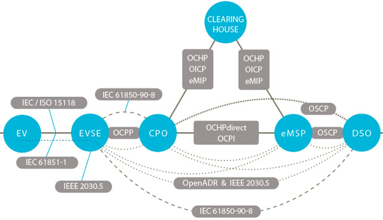

# Awesome Electric Vehicle 

**A carefully curated list of EV-related tools and resources**

## Contents

- [OCPP](#ocpp)
  - [Server](#ocpp-servers)
  - [Simulator](#ocpp-simulators)
  - [Libraries](#ocpp-libraries)
  - [Misc](#ocpp-misc)
- [iso15118](#iso15118)
  * [Misc](#iso15118-plug--charge)
  * [Misc](#iso15118-misc)
- [OCPI](#ocpi)
  - [Libraries](#ocpi-libraries)
- [OICP](#oicp)
- [eMI³](#emi)
- [OIOI](#oioi-discontinued)
- [CSMS](#csms)
- [Eichrecht](#eichrecht)
  - [Misc](#eichrecht-misc)

Here are some awesome tools for dealing with EV:

## OCPP

* [Wikipedia](https://en.wikipedia.org/wiki/Open_Charge_Point_Protocol)
* [Open Charge Aliance](https://www.openchargealliance.org/)
* Specifications
  * [1.2 (deprecated)](ocpp/OCPP-1.2)
  * [1.5 (deprecated)](ocpp/OCPP-1.5)
  * [1.6](ocpp/OCPP-1.6-Documentation_2019_12)
  * [1.6 - Security Whitepaper Ed3](ocpp/Whitepapers/OCPP-1.6-security-whitepaper-edition-3-2)
  * [2.0 (deprecated)](ocpp/OCPP-2.0)
  * [2.0.1](ocpp/OCPP-2.0.1)
  * [2.1](ocpp/OCPP-2.1)

### OCPP Servers

* [OCPP server implementation in Java](https://github.com/steve-community/steve)
* [Home Assistant integration for OCPP EV chargers](https://github.com/lbbrhzn/ocpp)
* [OCPP server and management UI written in .NET-Core](https://github.com/dallmann-consulting/ocpp.core)
* [Connectivity between WWCP and OCPP v1.6/v2.0](https://github.com/openchargingcloud/wwcp_ocpp)
* [Open Charge Point Protocol Node-Red Nodes](https://github.com/argonne-national-laboratory/node-red-contrib-ocpp)
* [Open e-Mobility Charging Station management backend server](https://github.com/charge-angels/ca-ev-server)
* [OCPP Scala implementation](https://github.com/ShellRechargeSolutionsEU/ocpp)
* [OCPP .NET-Core implementation](https://github.com/dallmann-consulting/OCPP.Core)
* [OCPP C++ implementation](https://github.com/c-jimenez/open-ocpp)
* [OCPP Rust implementation](https://github.com/codelabsab/rust-ocpp)

### OCPP Simulators

* [OCPP-J-CP-Simulator - A really simple OCPP 1.6 cp simulator](https://github.com/kubarskii/OCPP-J-CP-Simulator)
* [OCPP 1.6 Charge Point Simulator](https://github.com/javaisjavascript/ocpp-1.6-cp-simulator)
* [OCPP 2.0 Charge Point Simulator - A really simple OCPP 2.0 cp simulator](https://github.com/JavaIsJavaScript/OCPP-2.0-CP-Simulator)
* [Simple ocpp charger simulator](https://github.com/shellrechargesolutionseu/ocpp-charger)
* [Scriptable OCPP charge point simulator and test tool](https://github.com/shellrechargesolutionseu/docile-charge-point)
* [OCPP charger (charging station) simulator](https://github.com/vasyas/charger-simulator)
* [e-Mobility OCPP-J Charging Stations simulator](https://github.com/sap/e-mobility-charging-stations-simulator)

### OCPP Libraries

* [Python implementation of the Open Charge Point Protocol](https://github.com/mobilityhouse/ocpp)
* [Open Charge Point Protocol for Scala](github.com/ihomer/scala-ocpp)
* [Java-OCA-OCPP - A Java client and server library of Open Charge-Point Protocol](https://github.com/chargetimeeu/java-oca-ocpp)
* [OCPP 1.6 client for ESP32 / ESP8266](https://github.com/matth-x/ArduinoOcpp)
* [OCPP implementation in Go](https://github.com/lorenzodonini/ocpp-go)
* [v1.5 and v1.6 OCPP implementation in Golang](https://github.com/voltbras/go-ocpp)
* [OCPP implemented in Typescript](https://github.com/voltbras/ts-ocpp)
* [C++ implementation of the OCPP 1.6 protocol](https://github.com/c-jimenez/open-ocpp)
* [A Node.js client & server implementation of OCPP-J protcol](https://github.com/mikuso/ocpp-rpc)
* [Rust library for ocpp 1.6 and 2.0.1](https://github.com/codelabsab/rust-ocpp)
* [Java mappings for OCPP](https://github.com/steve-community/ocpp-jaxb)
* [Kotlin library to perform OCPP operations](https://github.com/izivia/ocpp-toolkit)
* [OCPP variable manager SDK for Go](https://github.com/ChargePi/ocpp-manager)

### OCPP Misc

* [OCPP Spec](https://ocpp-spec.org/)
* [OCPP AI](https://openchargealliance.org/oca-i-chatbot/)
* [ChargeFlow CLI for debugging and validating OCPP messages](https://github.com/ChargePi/chargeflow)

## iso15118

* [Wikipedia](https://en.wikipedia.org/wiki/ISO_15118)
* [iso](https://www.iso.org/search.html?PROD_isoorg_en%5Bquery%5D=15118&PROD_isoorg_en%5Bmenu%5D%5Bfacet%5D=standard)

### iso15118 Plug & Charge

* [OPNC](https://github.com/charinev/opnc)
* [OPCP](https://github.com/hubject/opcp)

### iso15118 Misc

* [sniffer-iso15118vse](https://github.com/endland/sniffer-iso15118vse)

## OCPI

* [EVRoaming Fundation](https://evroaming.org/)
* [Specifications](https://github.com/ocpi/ocpi)
  * [2.2.1](https://github.com/ocpi/ocpi/tree/release-2.2.1-bugfixes) - [pdf](https://github.com/ocpi/ocpi/releases/download/2.2.1/OCPI-2.2.1.pdf) 
  * [2.1.1](https://github.com/ocpi/ocpi/tree/release-2.1.1-bugfixes) - [pdf](https://github.com/ocpi/ocpi/releases/download/2.1.1-d2/OCPI_2.1.1-d2.pdf)

### OCPI Libraries

* [Endpoints in Scala](https://github.com/ShellRechargeSolutionsEU/ocpi-endpoints)
* [Client in PHP](https://github.com/ChargeMap/ocpi-protocol)
* [Server in Python](https://github.com/TECHS-Technological-Solutions/ocpi)
* [Endpoints and client in Kotlin](https://github.com/IZIVIA/ocpi-toolkit)
* [OCPI Types in TypeScript](https://github.com/gaia-green-tech/ocpi-types)
* [Endpoints in Python](https://github.com/NOWUM/pyOCPI)
* [OCPI Schema](https://github.com/solidstudiosh/ocpi-schema)
* [OCPI SDK in Go](https://github.com/ChargePi/ocpi-sdk-go)

## OICP

* [Specifications](https://github.com/hubject/oicp)
  * 2.1 - [pdf](https://cdn.prod.website-files.com/602cf2b08109ccbc93d7f9ed/60534f7deb559e2ab76f08c6_OICP-2.1_Release-14.1_EMP_final.pdf)
  * [2.2](https://github.com/hubject/oicp/tree/master/OICP-2.2)
  * [2.3](https://github.com/hubject/oicp/tree/master/OICP-2.3)

### OICP Libraries

- [OICP SDK in Go](https://github.com/ChargePi/oicp-sdk-go)

## OIOI (discontinued)

* [Latest specifications](https://juherr.dev/oioi-documentation/)

## eMI³

* [Website](http://emi3group.com/) ([Archive.org](https://web.archive.org/web/20230925033629/http://emi3group.com/))
* Specifications
  * eMi³ standard version V1.0 electric vehicle ICT interface specifications
    * [Part 1 v1.0](emi3/emi3-1.0/eMI3-standard-v1.0-Part-1.pdf)
    * [Part 2 v1.0](emi3/emi3-1.0/eMI3-standard-v1.0-Part-2.pdf)
    * [Terms and definitions v1.0](emi3/emi3-1.0/eMI3-standard-TermsAndDefinitions-v1.0.pdf)
  * eMi³ standard update, version V1.1 electric vehicle ICT interface specifications
    * [Part 1 v1.1](emi3/emi3-1.1/eMI3-standard-v1.1-Part-1.pdf)
    * [Terms and definitions v1.4](emi3/emi3-1.1/eMI3-standard-TermsAndDefinitions-v1.4.pdf)

## CSMS

* [maeve-csms](https://github.com/thoughtworks/maeve-csms)
* [citrineos](https://github.com/citrineos/citrineos-core) ([doc](https://github.com/citrineos/citrineos))
* [EVerest](https://github.com/EVerest/everest-core)

## Charging station projects 

* [OpenEVSE](https://github.com/OpenEVSE/open_evse)
* [ChargePi](https://github.com/ChargePi/ChargePi-go)

## Eichrecht

* [Whitepaper](https://openchargealliance.org/wp-content/uploads/2024/03/Presentation_Eichrecht_Plugfest.pdf)
* [Signed Meter Values in OCPP](https://openchargealliance.org/wp-content/uploads/2025/02/signed_meter_values-v10.pdf)
* [OCMF](https://github.com/SAFE-eV/OCMF-Open-Charge-Metering-Format/)

### Eichrecht Misc

* [transparenzsoftware](https://github.com/SAFE-eV/transparenzsoftware)
* [OCMF Go SDK](https://github.com/ChargePi/ocmf-go)

---

**Not curated list**

- [GitHub list juherr](https://github.com/stars/juherr/lists/ev)
- [GitHub list mateogreil](https://github.com/stars/mateogreil/lists/ev-mobility)
