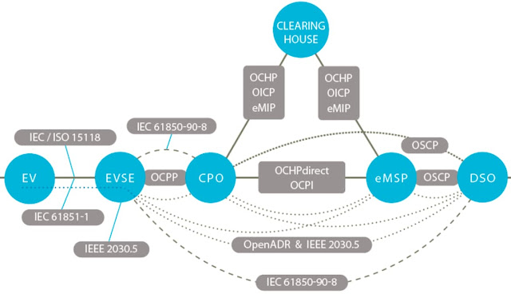

# Awesome Electric Vehicle 

A carefully curated list of specifications, tools, and resources for electric vehicle (EV) charging protocols — a central point of information for developers and enthusiasts working in the e-mobility space.

## Contents

<!-- BEGIN GENERATED TOC -->
- [Specifications](#specifications)
  - [OCPP (Open Charge Point Protocol)](#ocpp-open-charge-point-protocol)
  - [ISO 15118](#iso-15118)
  - [OCPI (Open Charge Point Interface)](#ocpi-open-charge-point-interface)
  - [OICP (Open InterCharge Protocol)](#oicp-open-intercharge-protocol)
  - [eMIP (eMobility Protocol Inter-Operation)](#emip-emobility-protocol-inter-operation)
  - [eMI³ (eMobility ICT Interoperability)](#emi-emobility-ict-interoperability)
  - [Eichrecht](#eichrecht)
  - [OIOI (discontinued)](#oioi-discontinued)
- [Tools and Resources](#tools-and-resources)
  - [OCPP](#ocpp)
  - [OCPI](#ocpi)
  - [iso15118](#iso15118)
  - [Eichrecht](#eichrecht-1)
  - [Other](#other-2)
<!-- END GENERATED TOC -->

## Specifications

### OCPP (Open Charge Point Protocol)

The **Open Charge Point Protocol (OCPP)** is a communication protocol between electric vehicle charging stations and a central management system.

- [Wikipedia](https://en.wikipedia.org/wiki/Open_Charge_Point_Protocol)
- [Open Charge Aliance](https://www.openchargealliance.org/)
- Specifications
  - [2.1](https://github.com/juherr/awesome-ev-charging/tree/main/ocpp/OCPP-2.1) (2025-01)
  - [2.0.1](https://github.com/juherr/awesome-ev-charging/tree/main/ocpp/OCPP-2.0.1) (2020-04)
  - [2.0 (deprecated)](https://github.com/juherr/awesome-ev-charging/tree/main/ocpp/OCPP-2.0) (2018)
  - [1.6](https://github.com/juherr/awesome-ev-charging/tree/main/ocpp/OCPP-1.6-Documentation_2019_12) (2015)
  - [1.6 - Security Whitepaper Ed3](https://github.com/juherr/awesome-ev-charging/tree/main/ocpp/Whitepapers/OCPP-1.6-security-whitepaper-edition-3-2)
  - [1.x - Multiple Connectors per EVSE](https://github.com/juherr/awesome-ev-charging/blob/main/ocpp/Whitepapers/ocpp_1_x_multiple_connectors_per_evse.pdf)
  - [1.5 (deprecated)](https://github.com/juherr/awesome-ev-charging/tree/main/ocpp/OCPP-1.5) (2012)
  - [1.2 (deprecated)](https://github.com/juherr/awesome-ev-charging/tree/main/ocpp/OCPP-1.2) (2010)

### ISO 15118

**ISO 15118** is an international standard for communication between electric vehicles and the charging station.

- [Wikipedia](https://en.wikipedia.org/wiki/ISO_15118)
- [iso.org](https://www.iso.org/search.html?PROD_isoorg_en%5Bquery%5D=15118&PROD_isoorg_en%5Bmenu%5D%5Bfacet%5D=standard)

### OCPI (Open Charge Point Interface)

The **Open Charge Point Interface (OCPI)** is a protocol for roaming between charging station networks.

- [EVRoaming Fundation](https://evroaming.org/)
- [Specifications on GitHub](https://github.com/ocpi/ocpi)
  - [2.3.0-d2](https://github.com/ocpi/ocpi/releases/download/v2.3.0-ed2/OCPI-2.3.0-ed2.pdf) (2026-06)
  - [2.3.0](https://evroaming.org/wp-content/uploads/2025/02/OCPI-2.3.0.pdf) (2025-02)
  - [2.2.1](https://github.com/ocpi/ocpi/releases/download/2.2.1/OCPI-2.2.1.pdf) (2021-10)
  - [2.2.0-d2](https://github.com/ocpi/ocpi/releases/download/2.2-d2/OCPI-2.2-d2.pdf) (2020-06)
  - [2.2.0](https://github.com/ocpi/ocpi/releases/download/2.2/OCPI-2.2.pdf) (2019-09)
  - [2.1.1-d2](https://github.com/ocpi/ocpi/releases/download/2.1.1-d2/OCPI_2.1.1-d2.pdf) (2019-06)
  - [2.1.1](https://github.com/ocpi/ocpi/releases/download/2.1.1/OCPI_2.1.1.pdf) (2017-06)
  - 2.1.0 - Deprecated, contains some bugs, use 2.1.1 instead (2016-04)
  - [2.0](https://github.com/ocpi/ocpi/files/135934/OCPI_2.0-d2.pdf) (2016-02)
- [ocpi.github.io](https://ocpi.github.io/) - OCPI feature-development hub: proposals and processes for upcoming spec versions.
- Official OpenAPI/Swagger definitions and migration guides (rendered from the [openapi-specification](#api-specification) project).
  - [2.3.0 Swagger UI](https://ocpi.github.io/openapi-specification/ocpi/2.3.0/)
  - [2.2.1 Swagger UI](https://ocpi.github.io/openapi-specification/ocpi/2.2.1/)
  - [2.2.1 → 2.3.0 migration guide](https://github.com/ocpi/openapi-specification/blob/main/migration-guides/2.2.1-2.3.0/summary.asciidoc)
- [ocpi.fyi](https://ocpi.fyi/) - A browsable rendering of the OCPI specification with an API reference and version comparison. 🏅
  - [2.3.0 Swagger](https://ocpi.fyi/api/2.3.0/swagger/) (unofficial)
  - [2.2.1 Swagger](https://ocpi.fyi/api/2.2.1/swagger/) (unofficial)
  - [2.1.1 Swagger](https://ocpi.fyi/api/2.1.1/swagger/) (unofficial)

#### Modules

- [Direct Payment](https://evroaming.org/wp-content/uploads/2024/10/DirectPayment_2_2_1___EVRF_version.pdf) (2.2.1, 2024-03)
- [e-PoI service](https://www.gireve.com/wp-content/uploads/2025/10/Gireve_Tech_ePoI-OCPI-2.2.1_ImplementationGuide_V1.1-_en.pdf) (2.2.1, Gireve, 2025-10)
- [Accessibility extension](https://evroaming.org/wp-content/uploads/2026/01/e_accessibility_extension-1.0.0.pdf) (2.3.0, 3.0, 2025-12)
- Booking (2.3.0)
  - [ed2](https://github.com/ocpi/ocpi/releases/download/v2.3.0-bookings/OCPI-2.3.0-bookings.pdf) (2026-06)
  - [1.1](https://evroaming.org/wp-content/uploads/2026/01/OCPI-2.3.0-booking-1.1.pdf) (2025-06)
- Payments (2.3.0)
  - [ed2](https://github.com/ocpi/ocpi/releases/download/v2.3.0-ed2-payments/OCPI-2.3.0-ed2-payments.pdf) (2026-06, adds invoice reconciliation)
  - [ed1](https://github.com/ocpi/ocpi/releases/download/v2.3.0-payments/OCPI-2.3.0-payments.pdf) (2026-06)
- [Autocharge](https://ocpi.fyi/ocpi/2.3.0/extensions/mod_autocharge_roaming.html) (2.3.0, community)

#### Roaming

Roaming relies on ID Registration Offices (IDRO) that assign and publish the operator (EVSE) and provider (contract) identifiers exchanged over OCPI.

- [Identification Registration Repository](https://alternative-fuels-observatory.ec.europa.eu/markets-and-policy/policy-insights/identification-registration-repository) - The European reference, maintained by the European Alternative Fuels Observatory.
- [IDRO Directory](https://idro.juherr.dev/) - A global directory aggregating e-mobility identifiers from national and regional IDRO registries.

### OICP (Open InterCharge Protocol)

The **Open InterCharge Protocol (OICP)** is another protocol for roaming, developed by Hubject.

- [Specifications on GitHub](https://github.com/hubject/oicp)
  - [2.3](https://github.com/hubject/oicp/tree/master/OICP-2.3) (2020-10)
  - 2.2: [CPO](https://github.com/hubject/oicp/releases/download/v2.2/OICP-CPO-2.2.pdf), [EMP](https://github.com/hubject/oicp/releases/download/v2.2/OICP-EMP-2.2.pdf) (2017-10)
  - 2.1: [CPO](https://github.com/hubject/oicp/releases/download/v2.1/OICP-CPO-2.1.pdf), [EMP](https://github.com/hubject/oicp/releases/download/v2.1/OICP-EMP-2.1.pdf) (2016-10, retired 2023-04-13)

### eMIP (eMobility Protocol Inter-Operation)

The **eMobility Protocol Inter-Operation (eMIP)** is a roaming protocol developed by [Gireve](https://www.gireve.com).

- [Protocol description v1.0.17](https://www.gireve.com/wp-content/uploads/2025/02/Gireve_Tech_eMIP-V0.7.4_ProtocolDescription_1.0.17-en.pdf) (2025-02)
- [Implementation guide v1.0.7](https://www.gireve.com/wp-content/uploads/2022/09/Gireve_Tech_eMIP-V0.7.4_ImplementationGuide_1.0.7_en.pdf) (2022-09)

### eMI³ (eMobility ICT Interoperability)

**eMI³ (eMobility ICT Interoperability)** was a European initiative for e-mobility interoperability.

- [Website (archived)](https://web.archive.org/web/20230925033629/http://emi3group.com/)
- Specifications
  - eMi³ standard version V1.1 electric vehicle ICT interface specifications (2019-10)
    - [Part 1 v1.1](https://github.com/juherr/awesome-ev-charging/blob/main/emi3/emi3-1.1/eMI3-standard-v1.1-Part-1.pdf)
    - [Terms and definitions v1.4](https://github.com/juherr/awesome-ev-charging/blob/main/emi3/emi3-1.1/eMI3-standard-TermsAndDefinitions-v1.4.pdf)
  - eMi³ standard version V1.0 electric vehicle ICT interface specifications (2019-10)
    - [Part 1 v1.0](https://github.com/juherr/awesome-ev-charging/blob/main/emi3/emi3-1.0/eMI3-standard-v1.0-Part-1.pdf)
    - [Part 2 v1.0](https://github.com/juherr/awesome-ev-charging/blob/main/emi3/emi3-1.0/eMI3-standard-v1.0-Part-2.pdf)
    - [Terms and definitions v1.0](https://github.com/juherr/awesome-ev-charging/blob/main/emi3/emi3-1.0/eMI3-standard-TermsAndDefinitions-v1.0.pdf)

### Eichrecht

**Eichrecht** is a German law for calibration and verification of measuring instruments, which applies to EV charging.

- [Whitepaper](https://openchargealliance.org/wp-content/uploads/2024/03/Presentation_Eichrecht_Plugfest.pdf)
- [Signed Meter Values in OCPP](https://openchargealliance.org/wp-content/uploads/2025/02/signed_meter_values-v10.pdf)

### OIOI (discontinued)

- [Latest specifications](https://juherr.dev/oioi-documentation/)

## Tools and Resources

This list features actively maintained, curated projects. Dormant, archived, or not-yet-reviewed projects are collected separately in [legacy-projects.md](legacy-projects.md).

<!-- BEGIN GENERATED PROJECTS -->
### OCPP

#### Server

- [steve-community/steve](https://github.com/steve-community/steve) - SteVe is a Java-based OCPP server and EV charging station management system for administering charge points, users, RFID authentication, security extensions, and related charging operations (OCPP 1.2, 1.5, 1.6 · Java · ⭐ 1078).
- [dallmann-consulting/OCPP.Core](https://github.com/dallmann-consulting/OCPP.Core) - OCPP.Core is a .NET OCPP server with a web UI for managing charge points, connectors, RFID tokens, transactions, and supported OCPP messages (OCPP 1.6, 2.0 · C# · ⭐ 296).
- [citrineos/citrineos-core](https://github.com/citrineos/citrineos-core) - CitrineOS is an open-source OCPP 1.6/2.0.1 charging station management server written in TypeScript with REST API and web-based operator UI (OCPP 1.6, 2.0.1 · TypeScript · ⭐ 260).
- [EVtivity/evtivity-csms](https://github.com/EVtivity/evtivity-csms) - EVtivity CSMS is a TypeScript charging station management system that manages EV charging infrastructure through OCPP 1.6/2.1 station communication, OCPI roaming, ISO 15118 Plug and Charge, REST APIs, and operator/driver web frontends (OCPP 1.6, 2.1 · TypeScript · ⭐ 18).
- [evcc-io/evcc](https://github.com/evcc-io/evcc) - Evcc is an open-source EV charge controller supporting OCPP and multiple integration protocols for solar-optimized, cloud-free home charging management (Go · ⭐ 6920).
- [apostoldevel/ocpp-cs](https://github.com/apostoldevel/ocpp-cs) - C++20 OCPP central system with a web UI, REST API, schema validation, and built-in charge point emulators for OCPP 1.5, 1.6, and 2.0.1 (OCPP 1.5, 1.6, 2.0.1 · C++ · ⭐ 76).
- [gertjana/ocpp-backend](https://github.com/gertjana/ocpp-backend) - An Elixir/Cowboy backend server for OCPP 1.6 charge point operations with limited OCPP 2.0 heartbeat support, a dashboard, and an API for sending charger commands (OCPP 1.6, 2.0 · Elixir · ⭐ 23).
- [ocpp-balanz/ocpp-2w-proxy](https://github.com/ocpp-balanz/ocpp-2w-proxy) - Ocpp-2w-proxy is a Python OCPP proxy that forwards charger traffic between one or more chargers and two central management systems with primary/secondary routing rules (Python · ⭐ 15).
- [savekar-ev/OCPP-1.6-Charging-Point-Management-System](https://github.com/savekar-ev/OCPP-1.6-Charging-Point-Management-System) - A full-stack OCPP 1.6 JSON Charge Point Management System for managing EV chargers through a WebSocket server, REST API, admin interface, and PostgreSQL backend (OCPP 1.6 · TypeScript · ⭐ 12).
- [OpenChargingCloud/CSMS](https://github.com/OpenChargingCloud/CSMS) - An example OCPP 1.6 Central System and OCPP 2.1/2.0.1 Charging Station Management System for testing EV charging infrastructure (OCPP 1.6, 2.1 · C# · ⭐ 8).
- [slachiewicz/ocpp-csms-backend](https://github.com/slachiewicz/ocpp-csms-backend) - Python/FastAPI and Vue3 CSMS for monitoring and controlling EV charging stations over WebSocket with queue-based charge point services and management logic (Python · ⭐ 7).
- [flowionab/ocpp-csms-server](https://github.com/flowionab/ocpp-csms-server) - OCPP CSMS Server is a Rust-based central system for managing EV charge points over OCPP 1.6 and 2.0.1 with WebSocket communication and authentication (Rust · ⭐ 5).
- [smartenergycontrol-be/ocpp-proxy](https://github.com/smartenergycontrol-be/ocpp-proxy) - A Home Assistant OCPP proxy that shares one EV charger across multiple backend services with OCPP 1.6/2.0.1 support and control arbitration (OCPP 1.6, 2.0.1, 2.1 · Python · ⭐ 5).
- [parklapp/steve-pluggable](https://github.com/parklapp/steve-pluggable) - SteVe Pluggable is a Java/Spring Boot OCPP server library for managing charge points, users, RFID authentication, and ESP backend integration (OCPP 1.2, 1.5, 1.6 · Java · ⭐ 4).
- [Beep-Technologies/esteban-ocpp](https://github.com/Beep-Technologies/esteban-ocpp) - Esteban-OCPP is a Go OCPP server for administering charge points and users, exposing REST APIs, and running EV charging deployments in cloud or edge environments (OCPP 2.0 · Go · ⭐ 4).
- [juherr/evolve](https://github.com/juherr/evolve) - EVolve - OCPP server implementation in Java (Java · ⭐ 4).
- [erik73/app-steve](https://github.com/erik73/app-steve) - Home Assistant add-on that packages the SteVe OCPP server for managing EV charge point communications (Dockerfile · ⭐ 3).
- [eveys-mobility/OCPP](https://github.com/eveys-mobility/OCPP) - Python OCPP CSMS gateway for Eveys that manages charger WebSocket connections and exposes REST, gRPC, Kafka events, webhooks, metrics, and storage integrations (OCPP 1.6 · Python · ⭐ 3).
- [FlipSoftware/moovolt-csms](https://github.com/FlipSoftware/moovolt-csms) - Moov.olt is a Rust-based OCPP central system for managing EV chargers through a charging point service and a management server connected via AMQP (Rust · ⭐ 3).
- [eliodecolli/Medinilla](https://github.com/eliodecolli/Medinilla) - Medinilla is an ASP.NET Core CSMS backend implementing selected OCPP messages for managing EV charging station connections and transactions (OCPP 2.0.1 · C# · ⭐ 3).
- [markrpo/ocppws](https://github.com/markrpo/ocppws) - C++ implementation of an OCPP server over WebSockets with support for core charge point messages (C++ · ⭐ 2).
- [elton-saraci/ocpp-central-system](https://github.com/elton-saraci/ocpp-central-system) - Spring Boot OCPP 1.6 central system for managing EV charge stations over WebSockets with transaction handling, status monitoring, remote commands, and REST APIs (OCPP 1.6 · Java · ⭐ 2).
- [alexeimoisseev/ocpp-server-typescript](https://github.com/alexeimoisseev/ocpp-server-typescript) - A minimal TypeScript OCPP WebSocket server for learning, testing chargers, and running simulators with support for OCPP 1.6J and 2.0.1 core charging flows (OCPP 1.6, 2.0.1 · TypeScript · ⭐ 1).
- [citrineos/citrineos](https://github.com/citrineos/citrineos) - CitrineOS is an open source OCPP 2.0.1 Charging Station Management System software stack with modular services for handling charging station communication and CSMS functions (OCPP 2.0.1 · ⭐ 142).

#### Simulator

- [SAP/e-mobility-charging-stations-simulator](https://github.com/SAP/e-mobility-charging-stations-simulator) - A Node.js-based simulator for OCPP-J charging stations that supports OCPP protocol versions 1.6 and 2.0.x with Web UI, CLI, and Docker deployment (OCPP 1.6, 2.0, 2.0.1 · TypeScript · ⭐ 222).
- [monta-app/ocpp-emulator](https://github.com/monta-app/ocpp-emulator) - A desktop GUI emulator for OCPP 1.6 and 2.0.1 charge points built with Kotlin Multiplatform, enabling message interception and testing capabilities (OCPP 1.6, 2.0.1 · Kotlin · ⭐ 170).
- [ozgurbayram/OCPPSimulator](https://github.com/ozgurbayram/OCPPSimulator) - A web-based OCPP 1.6 simulator for creating simulated EV charge points, connecting them to a CSMS, sending OCPP messages, and monitoring charging communication (OCPP 1.6 · TypeScript · ⭐ 24).
- [matth-x/MicroOcppSimulator](https://github.com/matth-x/MicroOcppSimulator) - MicroOcppSimulator is a GUI-based simulator and demo application that runs the MicroOCPP client on a host computer and connects to an OCPP server to simulate charging sessions and actions (C++ · ⭐ 168).
- [solidstudiosh/ocpp-virtual-charge-point](https://github.com/solidstudiosh/ocpp-virtual-charge-point) - A Node.js terminal-based simulator for OCPP 1.6 and 2.0.1 charging stations with configurable WebSocket connection settings and schema validation (OCPP 1.6, 2.0.1 · TypeScript · ⭐ 113).
- [OpenChargingCloud/ChargingStationApp](https://github.com/OpenChargingCloud/ChargingStationApp) - Electron-based virtual EV charging station for testing OCPP charging station protocols and related extensions (TypeScript · ⭐ 41).
- [shiv3/ocpp-cp-simulator](https://github.com/shiv3/ocpp-cp-simulator) - OCPP 1.6J charge point simulator with browser UI, CLI, and Socket.IO API for testing charge management systems and AI agents (OCPP 1.5, 1.6 · TypeScript · ⭐ 36).
- [virta-ltd/charge-device-simulator](https://github.com/virta-ltd/charge-device-simulator) - Python-based device simulator framework for EV charging protocols including OCPP and Ensto, packaged for Docker-based execution (Python · ⭐ 21).
- [road-labs/chargestation-one](https://github.com/road-labs/chargestation-one) - Browser-based OCPP charging station simulator supporting OCPP 1.6 and 2.0.1 for testing backend endpoints (OCPP 1.6, 2.0.1, 2.1 · Less · ⭐ 16).
- [c-jimenez/open-ocpp-simu](https://github.com/c-jimenez/open-ocpp-simu) - Open OCPP simulator provides an MQTT-based environment for launching, managing, monitoring, and configuring simulated OCPP charge points that connect to a central system (C++ · ⭐ 16).
- [kwtycoon/kilowatt-tycoon](https://github.com/kwtycoon/kilowatt-tycoon) - Kilowatt Tycoon is a Rust/Bevy tycoon game and EV charging network simulator that models CPO operations and emits OCPP, OCPI, and OpenADR datasets (OCPP 1.6 · Rust · ⭐ 7).
- [PlugSecure-Inc/ocpp-simulator-lab](https://github.com/PlugSecure-Inc/ocpp-simulator-lab) - OCPP Simulator Lab is a Python/FastAPI and Vue web tool that simulates OCPP charge points and CPMS endpoints for testing OCPP 1.6J, 2.0.1, and 2.1 behavior (OCPP 1.6, 2.0.1, 2.1 · Python · ⭐ 6).
- [vfg27/EmuOCPP](https://github.com/vfg27/EmuOCPP) - EmuOCPP is a Mininet/IPMininet-based OCPP emulator for simulating EV charging stations and central systems across OCPP 1.6, 2.0, and 2.0.1 with security profiles and certificate tooling (OCPP 1.6, 2.0, 2.0.1 · Python · ⭐ 5).
- [ReliON-Charging/everest-dcfc](https://github.com/ReliON-Charging/everest-dcfc) - A multi-architecture Docker container for running an EVerest-based virtual DC fast charger with configurable OCPP versions, connectors, smart charging, and a Node-RED simulation dashboard (OCPP 1.6, 2.0.1 · C++ · ⭐ 4).
- [wirelane/ocpp-client-simulator](https://github.com/wirelane/ocpp-client-simulator) - A Node.js command-line simulator for an OCPP 1.6 JSON/WebSocket charging station that connects to an OCPP server and exercises scenarios such as RFID authorization, remote start/stop, connectors, and signed meter values (OCPP 1.6 · JavaScript · ⭐ 3).
- [hlsxx/ocpp-charge-point-simulator](https://github.com/hlsxx/ocpp-charge-point-simulator) - A Rust CLI simulator for testing OCPP 1.6 backends by emulating configurable charge points in automated or idle modes (OCPP 1.6, 2.0.1 · Rust · ⭐ 2).

#### Libraries

##### C

- [pazzk-labs/ocpp](https://github.com/pazzk-labs/ocpp) - C implementation of an OCPP client with configurable build-time settings and example usage (⭐ 9).
- [tux-evse/afb-ocpp-ext](https://github.com/tux-evse/afb-ocpp-ext) - Libafb extension that adds OCPP 1.6 and 2.0.1 transport support for AFB micro-services (OCPP 1.6 · ⭐ 2).

##### C#

- [OpenChargingCloud/WWCP_OCPP](https://github.com/OpenChargingCloud/WWCP_OCPP) - WWCP OCPP is a software library for building OCPP 1.6, 2.0.1, and 2.1 services and gateways between OCPP and WWCP, including protocol extensions for security, overlay networking, and regulatory data exchange (OCPP 1.5, 1.6, 2.0.1, 2.1 · ⭐ 70).

##### C++

- [c-jimenez/open-ocpp](https://github.com/c-jimenez/open-ocpp) - Open OCPP is a C++17 library implementing the WebSocket/JSON variants of OCPP 1.6 and OCPP 2.0.1 (OCPP 1.6, 2.0.1 · ⭐ 168).
- [matth-x/MicroOcpp](https://github.com/matth-x/MicroOcpp) - MicroOCPP is a portable C/C++ OCPP 1.6 and 2.0.1 client library for integrating microcontroller-based EV chargers with OCPP central systems (OCPP 1.6, 2.0.1 · ⭐ 525).
- [ChargeLab/OpenOCPP](https://github.com/ChargeLab/OpenOCPP) - OpenOCPP is multi-platform embedded software implementing OCPP 1.6 and 2.0.1 for EV charging stations (OCPP 1.6 · ⭐ 78).

##### Go

- [lorenzodonini/ocpp-go](https://github.com/lorenzodonini/ocpp-go) - Go library for implementing OCPP-J central systems and charge point clients with support for OCPP 1.6, 1.6 Security, and 2.0.1 (OCPP 1.6, 2.0.1 · ⭐ 369).
- [aliml92/ocpp](https://github.com/aliml92/ocpp) - A Go library implementing JSON OCPP 1.6 and 2.0.1 with server and charge point client support (OCPP 1.6, 2.0.1 · ⭐ 28).
- [ChargePi/ocpp-manager](https://github.com/ChargePi/ocpp-manager) - A Go library for managing and validating OCPP configuration variables, including defaults, mandatory keys, custom validators, and versioned configurations (OCPP 1.6, 2.0.1 · ⭐ 6).
- [shiv3/gocpp](https://github.com/shiv3/gocpp) - Gocpp is a Go library for building typed OCPP 1.6, 2.0.1, and 2.1 CSMS servers and charge point clients with schema validation and pluggable storage, authentication, and observability (OCPP 1.6, 2.0.1, 2.1 · ⭐ 4).
- [aasanchez/ocpp16messages](https://github.com/aasanchez/ocpp16messages) - Type-safe Go library for constructing and validating OCPP 1.6 request and response messages (OCPP 1.6 · ⭐ 2).

##### Java

- [ChargeTimeEU/Java-OCA-OCPP](https://github.com/ChargeTimeEU/Java-OCA-OCPP) - Java-OCA-OCPP is a Java library for implementing OCPP Central Systems and Charge Points with OCPP 1.6 JSON/SOAP and OCPP 2.x support (OCPP 1.6, 2.0.1, 2.1 · ⭐ 370).

##### JavaScript

- [mikuso/ocpp-rpc](https://github.com/mikuso/ocpp-rpc) - OCPP-RPC is a Node.js client and server library for OCPP-J RPC communication over WebSockets (OCPP 1.6, 2.0.1, 2.1 · ⭐ 130).
- [argonne-vci/node-red-contrib-ocpp](https://github.com/argonne-vci/node-red-contrib-ocpp) - Node-RED nodes for communicating with OCPP 1.5 and 1.6 EV charge points and central systems over SOAP and JSON (OCPP 1.5, 1.6 · ⭐ 36).

##### Kotlin

- [monta-app/library-ocpp](https://github.com/monta-app/library-ocpp) - A Kotlin library for implementing OCPP protocol message handling with support for OCPP 1.6 and 2.0.1, providing synchronous and asynchronous interfaces for charge points and servers (OCPP 1.6 · ⭐ 6).
- [IZIVIA/ocpp-toolkit](https://github.com/IZIVIA/ocpp-toolkit) - A Kotlin library providing OCPP protocol implementation for both Charging Station and CSMS roles, supporting versions 1.5, 1.6, and 2.0.1 with WS/JSON and SOAP transport (OCPP 1.5, 1.6, 2.0 · ⭐ 44).

##### Python

- [mobilityhouse/ocpp](https://github.com/mobilityhouse/ocpp) - Python library implementing JSON-based OCPP 1.6 and 2.0.1 for building OCPP clients and servers (OCPP 1.6, 2.0.1 · ⭐ 1025).

##### Rust

- [tommymalmqvist/rust-ocpp](https://github.com/tommymalmqvist/rust-ocpp) - Rust-ocpp is a Rust library implementing OCPP 1.6, 2.0.1, and work-in-progress 2.1 data models validated against official JSON schemas (OCPP 1.6, 2.0.1, 2.1 · ⭐ 100).
- [flowionab/ocpp-client](https://github.com/flowionab/ocpp-client) - Ocpp-client is a Rust library for implementing OCPP 1.6 and 2.0.1 client communication with CSMS servers (OCPP 1.6 · ⭐ 4).
- [evlinked/ocpp-rs](https://github.com/evlinked/ocpp-rs) - A Rust library providing production-grade OCPP 1.6J and 2.0.1 implementation with integrated CSMS server, charge point simulator, and conformance tests (OCPP 1.6, 2.0.1 · ⭐ 3).

##### TypeScript

- [voltbras/ts-ocpp](https://github.com/voltbras/ts-ocpp) - TypeScript library for implementing OCPP central systems and charge points with support for OCPP-JSON 1.6 and OCPP-SOAP 1.5 (⭐ 49).
- [jacoscaz/typed-ocpp](https://github.com/jacoscaz/typed-ocpp) - A TypeScript library for type-aware validation of OCPP 1.6, 2.0, and 2.1 messages against official JSON schemas (OCPP 1.6, 2.0, 2.1 · ⭐ 9).
- [connected-hil/ocpp-tools](https://github.com/connected-hil/ocpp-tools) - A TypeScript library providing OCPP 1.6J and 2.0.1 message types, RPC utilities, parsers, and schema-based validation (OCPP 1.6, 2.0.1, 2.1 · ⭐ 7).

##### Other

- [appspace/kwwhat](https://github.com/appspace/kwwhat) - An open-source dbt data transformation library that processes raw OCPP logs into structured analytics models for EV charging reliability, utilization, and session outcome metrics (OCPP 1.6, 2.0.1, 2.1 · ⭐ 14).

#### Misc

- [lbbrhzn/ocpp](https://github.com/lbbrhzn/ocpp) - Home Assistant integration for monitoring and controlling EV chargers that communicate via OCPP 1.6j, 2.0.1, and experimental 2.1 (Python · ⭐ 377).
- [EVerest/EVerest](https://github.com/EVerest/EVerest) - EVerest is an open-source modular framework for building EV charging station software with support for OCPP, ISO 15118, hardware drivers, and energy management (OCPP 1.6, 2.0.1, 2.1 · C++ · ⭐ 221).
- [OpenEVSE/openevse_esp32_firmware](https://github.com/OpenEVSE/openevse_esp32_firmware) - An ESP32 WiFi gateway for OpenEVSE charging controllers with OCPP V1.6, MQTT, and web-based control (OCPP 1.6 · C · ⭐ 227).
- [alexeimoisseev/ocpp.md](https://github.com/alexeimoisseev/ocpp.md) - An OCPP knowledge base and AI agent plugin providing structured message schemas, sequence diagrams, use-case catalogs, and implementation guidance for OCPP 2.1, 2.0.1, and 1.6J (OCPP 1.6, 2.0.1, 2.1 · Python · ⭐ 18).
- [vfg27/CheckOCPP](https://github.com/vfg27/CheckOCPP) - CheckOCPP is a Wireshark Lua dissector that detects OCPP JSON traffic versions and validates captured messages against protocol schemas for passive compliance auditing (OCPP 1.6, 2.0, 2.0.1 · Lua · ⭐ 12).
- [vampirebyte/rabbitmq-web-ocpp](https://github.com/vampirebyte/rabbitmq-web-ocpp) - RabbitMQ Web OCPP is a RabbitMQ plugin that translates OCPP-over-WebSocket connections from EV charge stations into AMQP-routed messages (Erlang · ⭐ 10).
- [joulo-nl/joulo-ocpp-proxy](https://github.com/joulo-nl/joulo-ocpp-proxy) - An OCPP WebSocket proxy service that routes charger connections to a primary CSMS and optionally mirrors traffic to secondary backends for monitoring and migration (OCPP 1.6, 2.0, 2.0.1 · TypeScript · ⭐ 9).
- [powerly-ev/open-ev-charge-android-app](https://github.com/powerly-ev/open-ev-charge-android-app) - Powerly Open EV Charge Android App is a white-label Kotlin mobile app for discovering chargers, managing EV charging sessions, bookings, billing, roaming, and peer-to-peer charger sharing through the Powerly platform (Kotlin · ⭐ 7).
- [unified-error-codes/csds](https://github.com/unified-error-codes/csds) - UEC Software Stack provides backend, UI, and EVSE-agent components for charging station diagnostics using unified error codes and telemetry retrieved via OCPP (Python · ⭐ 6).
- [EVtivity/evtivity-mobile-app](https://github.com/EVtivity/evtivity-mobile-app) - Native iOS and Android driver app for the EVtivity EV charging platform that connects to its REST API for branded driver portal functionality (TypeScript · ⭐ 4).
- [chargex-consortium/ev-charge-seq-state](https://github.com/chargex-consortium/ev-charge-seq-state) - Open-source UML sequence diagrams and finite-state machine models for SAE J1772, ISO 15118, and OCPP EV charging protocol flows (OCPP 1.6, 2.0.1, 2.1 · ⭐ 4).
- [ocpp-debugkit/ocpp-debugkit](https://github.com/ocpp-debugkit/ocpp-debugkit) - An open-source developer toolkit for analyzing and debugging OCPP charging session traces with failure detection, replay engine, and report generation (TypeScript · ⭐ 3).
- [OpenChargingTechnology/Whitepapers](https://github.com/OpenChargingTechnology/Whitepapers) - A collection of open EV infrastructure ICT whitepapers covering cybersecurity, interoperability, OCPP, OCPI, OICP, ISO 15118, EV roaming, OpenADR, and related protocols (OCPP 1.6, 2.1 · ⭐ 2).
- [eliodecolli/ocpp-test-cases](https://github.com/eliodecolli/ocpp-test-cases) - AI-generated test cases for base OCPP 2.0.1 implementations, with scripts and prompts used to extract protocol text and generate additional cases (OCPP 2.0.1 · Python · ⭐ 1).
- [OpenChargingTechnology/OCPP-SBOM](https://github.com/OpenChargingTechnology/OCPP-SBOM) - OCPP-SBOM provides CycloneDX and SPDX SBOM definitions for OCPP specification release bundles, including PDFs, appendices, schemas, metadata, and hashes for verification and compliance (OCPP 2.1 · ⭐ 1).
- [xBlaz3kx/evcc-helm-chart](https://github.com/xBlaz3kx/evcc-helm-chart) - Helm chart for deploying EVCC, an EV charging controller, on Kubernetes with configurable services and SQLite backups (Go Template · ⭐ 0).

#### Charge Point

- [SmartEVSE/SmartEVSE-3](https://github.com/SmartEVSE/SmartEVSE-3) - SmartEVSE v3 is open-source firmware and hardware for an EVSE charge controller with smart load balancing, Modbus/RS485 metering, WiFi, MQTT/REST APIs, and OCPP 1.6J support (OCPP 1.6 · C · ⭐ 221).
- [ChargePi/ChargePi-go](https://github.com/ChargePi/ChargePi-go) - ChargePi-go is Linux-based charge point software that abstracts EV charging station hardware and provides OCPP support, a management UI, and an API (OCPP 1.6, 2.0.1, 2.1 · Go · ⭐ 51).

#### Proxy

- [openchargehub/ocpp-proxy](https://github.com/openchargehub/ocpp-proxy) - A Home Assistant add-on that proxies a single OCPP 1.6 or 2.0.1 EV charger connection to multiple backend services with arbitration, monitoring, and safety controls (OCPP 1.6, 2.0.1, 2.1 · Python · ⭐ 16).

#### Test Suite

- [tzi-app/tzi-OCTT](https://github.com/tzi-app/tzi-OCTT) - A Python pytest-based OCTT test suite for verifying CSMS implementations against OCPP 2.0.1 and OCPP 1.6J (OCPP 1.6, 2.0.1 · Python · ⭐ 12).

### OCPI

#### Server

- [citrineos/citrineos-ocpi](https://github.com/citrineos/citrineos-ocpi) - CitrineOS OCPI provides OCPI 2.2.1 CPO modules for CitrineOS Core, using its GraphQL API and PostgreSQL events to handle partner registration, OCPI endpoints, and data pushes to eMSPs (OCPI 2.2.1 · TypeScript · ⭐ 20).
- [olisystems/ocn-node-v2](https://github.com/olisystems/ocn-node-v2) - An OCPI v2.2 server implementation that acts as a decentralized eRoaming hub for brokering peer-to-peer EV charging requests between registered platforms (OCPI 2.2 · Kotlin · ⭐ 1).

#### Simulator

- [savekar-ev/OCPI-2.2.1-EMSP-Simulator](https://github.com/savekar-ev/OCPI-2.2.1-EMSP-Simulator) - A Python OCPI 2.2.1 EMSP simulator for testing CPO backend compliance, credentials exchange, data synchronization, sessions, commands, and CDR submissions (OCPI 2.2.1 · Python · ⭐ 10).
- [OpenChargingCloud/OCPIExplorerDesktopApp](https://github.com/OpenChargingCloud/OCPIExplorerDesktopApp) - OCPI Explorer DesktopApp is an Electron desktop application for testing and certification of OCPI protocol implementations and vendor extensions across multiple OCPI versions (OCPI 2.1, 2.1.1, 2.2, 2.2.1, 2.3.0 · TypeScript · ⭐ 5).
- [rally-finance/ocpi-mock-hub](https://github.com/rally-finance/ocpi-mock-hub) - A Go-based mock OCPI 2.2.1 hub server for developing and testing eMSP/CPO OCPI integrations without a live partner (OCPI 2.2.1 · Go · ⭐ 3).

#### Libraries

##### C#

- [OpenChargingCloud/WWCP_OCPI](https://github.com/OpenChargingCloud/WWCP_OCPI) - WWCP OCPI is a software bridge that enables communication between WWCP entities and OCPI 2.1.1, 2.2.1, 2.3.0, and draft 3.0 implementations for EV roaming (OCPI 2.0, 2.1, 2.1.1, 2.2, 2.2.1, 2.3.0 · ⭐ 29).
- [BitzArt/OCPI.Net](https://github.com/BitzArt/OCPI.Net) - OCPI.Net is a C#/.NET library implementing the Open Charge Point Interface for EV charging roaming (⭐ 27).

##### Java

- [steve-community/ocpi-models](https://github.com/steve-community/ocpi-models) - A Java library providing OCPI 2.2.1 data models, Spring MVC API mappings, and RestTemplate clients for building OCPI-compatible applications (OCPI 2.2.1 · ⭐ 2).

##### Kotlin

- [IZIVIA/ocpi-toolkit](https://github.com/IZIVIA/ocpi-toolkit) - Kotlin toolkit for implementing OCPI 2.2.1 business logic, validation, DTOs, and client/server modules independent of transport and persistence (OCPI 2.2.1 · ⭐ 34).

##### PHP

- [mrbig/ocpi-protocol](https://github.com/mrbig/ocpi-protocol) - PHP library providing OCPI 2.2.1 request/response classes, models, factories, errors, and client helpers for eMSP and CPO integrations using PSR-compatible HTTP interfaces (OCPI 2.2.1 · ⭐ 2).

##### Python

- [TECHS-Technological-Solutions/ocpi](https://github.com/TECHS-Technological-Solutions/ocpi) - Py-ocpi is a Python library implementing OCPI with schemas, CRUD integration, and adapters for connecting central-system data to the protocol (⭐ 63).
- [extrawest/extrawest_ocpi](https://github.com/extrawest/extrawest_ocpi) - Extrawest OCPI is a FastAPI-based Python implementation of the OCPI protocol supporting versions 2.2.1 and 2.1.1 (⭐ 11).
- [elumobility/ocpi-python](https://github.com/elumobility/ocpi-python) - OCPI Python is a FastAPI and Pydantic v2 implementation of the OCPI protocol supporting versions 2.3.0, 2.2.1, and 2.1.1 for CPO, EMSP, and PTP roles (OCPI 2.2.1, 2.3.0 · ⭐ 7).
- [evorada/ocpi-types](https://github.com/evorada/ocpi-types) - Ocpi-types provides auto-generated OCPI protocol type definitions for Go, Python, Rust, and TypeScript across multiple OCPI versions (OCPI 2.3.0 · ⭐ 5).

##### Rust

- [evlinked/ocpi-rs](https://github.com/evlinked/ocpi-rs) - A production-grade Rust library implementing the OCPI protocol with typed models, async HTTP client, and server handler traits supporting all OCPI versions for EV charging roaming (OCPI 2.1.1, 2.2.1, 2.3.0 · ⭐ 2).

##### TypeScript

- [shiv3/gocpi](https://github.com/shiv3/gocpi) - Gocpi is a Go library that provides generated typed OCPI clients, server handlers, validation, transport semantics, and pricing utilities for OCPI 2.1.1, 2.2.1, and 2.3.0 e-mobility roaming (OCPI 2.1.1, 2.2.1, 2.3.0 · ⭐ 1).

##### Other

- [tandemdrive/ocpi-tariffs](https://codeberg.org/tandemdrive/ocpi-tariffs) - A project for calculating tariffs according to OCPI (⭐ 41).

#### Misc

- [Quentin-BACQUET/GIREVE_Tech_OCPI_V2.2.1](https://github.com/Quentin-BACQUET/GIREVE_Tech_OCPI_V2.2.1) - GIREVE OCPI V2.2.1 is documentation for implementing GIREVE’s IOP hub interface, including OCPI integration guidelines for CPO and eMSP roaming workflows (OCPI 2.2.1 · ⭐ 2).
- [ocpi/ocpi-tool](https://github.com/ocpi/ocpi-tool) - Ocpi-tool is a CLI tool for exporting and privacy-filtering data from OCPI platforms for downstream ETL workflows (OCPI 2.2.1 · TypeScript · ⭐ 32).
- [Quentin-BACQUET/GIREVE_Tech_OCPI_V2.1.1](https://github.com/Quentin-BACQUET/GIREVE_Tech_OCPI_V2.1.1) - GIREVE OCPI V2.1.1 is an implementation guide for integrating CPO and eMSP systems with GIREVE’s IOP OCPI 2.1.1 roaming interface (OCPI 2.1.1 · ⭐ 5).
- [OpenChargingCloud/OCPIExplorerWebApp](https://github.com/OpenChargingCloud/OCPIExplorerWebApp) - A web application for exploring, testing, and certification support of OCPI protocol implementations and vendor extensions (OCPI 2.1, 2.1.1, 2.2.1, 2.3.0 · TypeScript · ⭐ 2).
- [juherr/ocpi-fyi](https://github.com/juherr/ocpi-fyi) - Ocpi.fyi is an unofficial multi-version Antora documentation site that mirrors OCPI specification releases and publishes versioned docs, API references, search, and catalogs (OCPI 2.1.1, 2.2.1, 2.3.0 · JavaScript · ⭐ 2).
- [olisystems/ocn-registry-v2.0](https://github.com/olisystems/ocn-registry-v2.0) - Ethereum-based smart contracts and a CLI for registering OCN node operators, OCPI parties, service providers, certificates, and oracles on the Open Charging Network (TypeScript · ⭐ 1).

### iso15118

#### Plug&Charge

- [SwitchEV/RISE-V2G](https://github.com/SwitchEV/RISE-V2G) - RISE V2G is an open-source reference implementation of the ISO 15118 vehicle-to-grid communication interface between EVs and charging stations, including Plug & Charge and load control support (Java · ⭐ 260).
- [hubject/opcp](https://github.com/hubject/opcp) - Open Plug&Charge Protocol is an open protocol specification for creating, transferring, signing, and interoperating Plug&Charge certificate and contract information based on ISO 15118 (JavaScript · ⭐ 73).
- [charinev/opnc](https://github.com/charinev/opnc) - OPNC is an open-source protocol specification for trusted Plug&Charge communication and PKI ecosystem interoperability in EV charging, covering related ISO 15118 functions (JavaScript · ⭐ 25).

#### Misc

- [uhi22/pyPLC](https://github.com/uhi22/pyPLC) - Python tools for experimenting with CCS charging communication, including PLC traffic sniffing and EVSE/PEV modes for ISO 15118/DIN 70121 workflows (Python · ⭐ 226).
- [EcoG-io/iso15118](https://github.com/EcoG-io/iso15118) - Python implementation of the ISO 15118-2, ISO 15118-20, and ISO 15118-8 communication protocols with SECC and EVCC components (Python · ⭐ 241).
- [dspace-group/dsV2Gshark](https://github.com/dspace-group/dsV2Gshark) - DsV2Gshark is a Wireshark plugin for decoding and analyzing ISO 15118, DIN 70121, and related V2G communication between EVs and charging stations (C++ · ⭐ 100).
- [uhi22/ccs32clara](https://github.com/uhi22/ccs32clara) - Embedded STM32 firmware for a CCS charge controller that communicates with a QCA7005 HomePlug Green PHY modem to control EV charging (C · ⭐ 107).

### Eichrecht

#### Misc

- [SAFE-eV/transparenzsoftware](https://github.com/SAFE-eV/transparenzsoftware) - Transparenzsoftware is a Java CLI and Swing application for verifying OCMF metrology measurement data from EV charging station meters for MID and German Eichrecht compliance (Java · ⭐ 34).
- [SAFE-eV/OCMF-Open-Charge-Metering-Format](https://github.com/SAFE-eV/OCMF-Open-Charge-Metering-Format) - A Markdown-maintained specification repository for the Open Charge Metering Format (OCMF) used in EV charging metering data (⭐ 32).

#### OCMF Libraries

- [road-labs/ocmf-js](https://github.com/road-labs/ocmf-js) - TypeScript/JavaScript library for signing, parsing, and verifying Open Charge Metering Format signed meter data (TypeScript · ⭐ 3).

### Other

- [OpenEMS/openems](https://github.com/OpenEMS/openems) - OpenEMS is an open-source modular energy management system platform for monitoring, controlling, and integrating renewable energy sources, storage, and devices including EV charging stations (Java · ⭐ 1444).
- [leeyuentuen/alfen_wallbox](https://github.com/leeyuentuen/alfen_wallbox) - A Home Assistant custom integration for monitoring and controlling Alfen wallboxes (Python · ⭐ 102).
- [chargeprice/chargeprice-api-docs](https://github.com/chargeprice/chargeprice-api-docs) - Documentation and API reference for the Chargeprice commercial data platform, providing REST API access to EV charging tariffs, charge points, operators, and vehicle specifications (⭐ 43).
- [open-ev-data/open-ev-data-dataset](https://github.com/open-ev-data/open-ev-data-dataset) - OpenEV Data Dataset is a versioned open dataset of electric vehicle specifications authored as layered JSON and compiled into canonical records for analysis and integration (JavaScript · ⭐ 26).
- [unified-error-codes/specification](https://github.com/unified-error-codes/specification) - Draft specification for standardized error codes and diagnostics across the EV charging ecosystem (Python · ⭐ 4).
- [ChargePi/openev-data-mcp](https://github.com/ChargePi/openev-data-mcp) - An MCP server that exposes the open-ev-data electric vehicle specifications dataset as JSON resources backed by PostgreSQL (PLpgSQL · ⭐ 1).

#### API Specification

- [ocpi/openapi-specification](https://github.com/ocpi/openapi-specification) - This project provides an OpenAPI specification for EV charging-related APIs (JavaScript · ⭐ 2).

#### Battery

- [dalathegreat/Battery-Emulator](https://github.com/dalathegreat/Battery-Emulator) - Battery-Emulator is firmware that enables reused EV battery packs to interface with residential solar inverters, translating battery management protocols to enable stationary home energy storage (C++ · ⭐ 2763).
- [mnh-jansson/open-battery-information](https://github.com/mnh-jansson/open-battery-information) - Open Battery Information provides Arduino and Python/Windows tools and battery data to help inspect and repair locked battery management systems (C++ · ⭐ 1545).
- [remontsuri/EV-QA-Framework](https://github.com/remontsuri/EV-QA-Framework) - EV-QA-Framework is a Python QA framework for EV battery systems that validates BMS telemetry, detects anomalies, predicts SOH, simulates CAN/J1939 data, and exposes monitoring dashboards (Python · ⭐ 6).

#### Charging location registry/API

- [openchargemap/ocm-system](https://github.com/openchargemap/ocm-system) - Open Charge Map is a backend, website, API, and import-processing system for maintaining and serving an open global registry of EV charging locations (C# · ⭐ 144).

#### Dataset

- [vbalagovic/cars-dataset](https://github.com/vbalagovic/cars-dataset) - CarsDataset is a global automotive specifications database and REST API providing technical specs, performance data, and market prices for 54,000+ vehicle variants (cars, trucks, motorcycles) across 370+ brands from 1898–2026 (⭐ 23).

#### EVSE firmware

- [dzurikmiroslav/esp32-evse](https://github.com/dzurikmiroslav/esp32-evse) - ESP32 EVSE is J1772 charging station firmware with web control, OTA updates, metering, REST, Modbus, scripting, and hardware abstraction (C · ⭐ 137).

#### Error Codes Specification

- [charinev/unified-error-codes](https://github.com/charinev/unified-error-codes) - Draft specification by CharIN for standardized unified error codes and diagnostics across the EV charging ecosystem (Python · ⭐ 9).

#### Home Assistant integration

- [lachand/EV_charger](https://github.com/lachand/EV_charger) - Home Assistant integration for controlling Tuya EV chargers locally over LAN with TinyTuya, including charge control and surplus solar charging modes (Python · ⭐ 9).

#### Libraries

##### Go

- [enbility/eebus-go](https://github.com/enbility/eebus-go) - A Go library implementing the EEBUS protocol stack for energy management and EV charging applications, with SHIP/SPINE support, certificate handling, mDNS, and device pairing (⭐ 111).

#### Maps & route planning

- [ev-map/EVMap](https://github.com/ev-map/EVMap) - EVMap is an Android app for finding EV charging stations using GoingElectric.de and OpenChargeMap data, with maps, filtering, availability, favorites, and Android Auto/Automotive support (Kotlin · ⭐ 268).

#### Mobility identifiers

- [juherr/mobilityid](https://github.com/juherr/mobilityid) - A multi-language monorepo providing libraries for parsing and handling EV mobility identifiers (PHP · ⭐ 2).

#### Monitoring

- [MTES-MCT/qualicharge](https://github.com/MTES-MCT/qualicharge) - QualiCharge collects and analyzes EV charging station supervision data to monitor and improve service quality (Python · ⭐ 10).

#### Open Data

- [openchargemap/ocm-export](https://github.com/openchargemap/ocm-export) - Ocm-export exports live Open Charge Map EV charging POI data into per-country, per-POI JSON files for granular change tracking and reuse (JavaScript · ⭐ 47).

#### Platform

- [zephyrproject-rtos/zephyr](https://github.com/zephyrproject-rtos/zephyr) - Zephyr is a scalable, secure real-time operating system (RTOS) for resource-constrained embedded and IoT devices, supporting multiple hardware architectures (C · ⭐ 15846).
- [SolarNetwork/solarnetwork-central](https://github.com/SolarNetwork/solarnetwork-central) - A cloud platform for SolarNetwork that manages user accounts, IoT device provisioning, and energy data collection via REST APIs, with support for OCPP integration (Java · ⭐ 6).

#### Registry

- [juherr/open-idro-directory](https://github.com/juherr/open-idro-directory) - An open-source directory service that aggregates, validates, and publishes e-mobility identifiers from official national and regional IDRO registries via API (TypeScript · ⭐ 2).

#### Route planning

- [GeiserX/Pumperly](https://github.com/GeiserX/Pumperly) - Pumperly is a self-hostable route planner that maps fuel stations and EV chargers along routes using real-time price and charging-station data (TypeScript · ⭐ 25).

<!-- END GENERATED PROJECTS -->

## Contributing

Contributions are welcome! If you know of a tool or resource that is not on the list, please feel free to add it.

The easiest way to contribute is to [open an issue](https://github.com/juherr/awesome-ev-charging/issues/new/choose) using the "Add a link" template.

You can also submit a pull request. Note that the project listing above is **generated** — descriptions and categories are edited in `classifications.csv`, not by hand in this file. See [CONTRIBUTING.md](CONTRIBUTING.md) for the full workflow.
