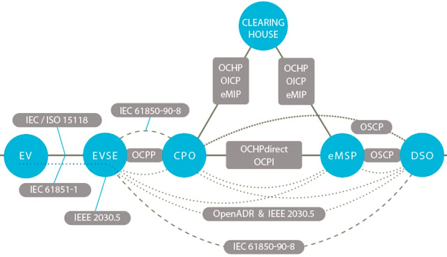

# Awesome Electric Vehicle 

A carefully curated list of specifications, tools, and resources for electric vehicle (EV) charging protocols — a central point of information for developers and enthusiasts working in the e-mobility space.

## Contents

<!-- BEGIN GENERATED TOC -->
- [Specifications](#specifications)
  - [OCPP (Open Charge Point Protocol)](#ocpp-open-charge-point-protocol)
  - [ISO 15118](#iso-15118)
  - [OCPI (Open Charge Point Interface)](#ocpi-open-charge-point-interface)
  - [OICP (Open InterCharge Protocol)](#oicp-open-intercharge-protocol)
  - [eMIP (eMobility Protocol Inter-Operation)](#emip-emobility-protocol-inter-operation)
  - [eMI³ (eMobility ICT Interoperability)](#emi-emobility-ict-interoperability)
  - [Eichrecht](#eichrecht)
  - [OIOI (discontinued)](#oioi-discontinued)
- [Tools and Resources](#tools-and-resources)
  - [OCPP](#ocpp)
  - [OCPI](#ocpi)
  - [iso15118](#iso15118)
  - [Eichrecht](#eichrecht-1)
  - [Other](#other-1)
<!-- END GENERATED TOC -->

## Specifications

### OCPP (Open Charge Point Protocol)

The **Open Charge Point Protocol (OCPP)** is a communication protocol between electric vehicle charging stations and a central management system.

- [Wikipedia](https://en.wikipedia.org/wiki/Open_Charge_Point_Protocol)
- [Open Charge Aliance](https://www.openchargealliance.org/)
- Specifications
  - [2.1](https://github.com/juherr/awesome-ev-charging/tree/main/ocpp/OCPP-2.1) (2025-01)
  - [2.0.1](https://github.com/juherr/awesome-ev-charging/tree/main/ocpp/OCPP-2.0.1) (2020-04)
  - [2.0 (deprecated)](https://github.com/juherr/awesome-ev-charging/tree/main/ocpp/OCPP-2.0) (2018)
  - [1.6](https://github.com/juherr/awesome-ev-charging/tree/main/ocpp/OCPP-1.6-Documentation_2019_12) (2015)
  - [1.6 - Security Whitepaper Ed3](https://github.com/juherr/awesome-ev-charging/tree/main/ocpp/Whitepapers/OCPP-1.6-security-whitepaper-edition-3-2)
  - [1.x - Multiple Connectors per EVSE](https://github.com/juherr/awesome-ev-charging/blob/main/ocpp/Whitepapers/ocpp_1_x_multiple_connectors_per_evse.pdf)
  - [1.5 (deprecated)](https://github.com/juherr/awesome-ev-charging/tree/main/ocpp/OCPP-1.5) (2012)
  - [1.2 (deprecated)](https://github.com/juherr/awesome-ev-charging/tree/main/ocpp/OCPP-1.2) (2010)
- [Configuration Keys (1.6)](https://github.com/juherr/awesome-ev-charging/blob/main/ocpp/OCPP-1.6-configuration-keys.md) - Reference table of OCPP 1.6 configuration keys.

### ISO 15118

**ISO 15118** is an international standard for communication between electric vehicles and the charging station.

- [Wikipedia](https://en.wikipedia.org/wiki/ISO_15118)
- [iso.org](https://www.iso.org/search.html?PROD_isoorg_en%5Bquery%5D=15118&PROD_isoorg_en%5Bmenu%5D%5Bfacet%5D=standard)

### OCPI (Open Charge Point Interface)

The **Open Charge Point Interface (OCPI)** is a protocol for roaming between charging station networks.

- [EVRoaming Fundation](https://evroaming.org/)
- [Specifications on GitHub](https://github.com/ocpi/ocpi)
  - [2.3.0-d2](https://github.com/ocpi/ocpi/releases/download/v2.3.0-ed2/OCPI-2.3.0-ed2.pdf) (2026-06)
  - [2.3.0](https://evroaming.org/wp-content/uploads/2025/02/OCPI-2.3.0.pdf) (2025-02)
  - [2.2.1](https://github.com/ocpi/ocpi/releases/download/2.2.1/OCPI-2.2.1.pdf) (2021-10)
  - [2.2.0-d2](https://github.com/ocpi/ocpi/releases/download/2.2-d2/OCPI-2.2-d2.pdf) - Deprecated, use 2.2.1 instead (2020-06)
  - [2.2.0](https://github.com/ocpi/ocpi/releases/download/2.2/OCPI-2.2.pdf) - Deprecated, use 2.2.0-d2 instead (2019-09)
  - [2.1.1-d2](https://github.com/ocpi/ocpi/releases/download/2.1.1-d2/OCPI_2.1.1-d2.pdf) (2019-06)
  - [2.1.1](https://github.com/ocpi/ocpi/releases/download/2.1.1/OCPI_2.1.1.pdf) - Deprecated, use 2.1.1-d2 instead (2017-06)
  - 2.1.0 - Deprecated, contains some bugs, use 2.1.1 instead (2016-04)
  - [2.0](https://github.com/ocpi/ocpi/files/135934/OCPI_2.0-d2.pdf) (2016-02)
- [ocpi.github.io](https://ocpi.github.io/) - OCPI feature-development hub: proposals and processes for upcoming spec versions.
- Official OpenAPI/Swagger definitions and migration guides (rendered from the [openapi-specification](#api-specification) project).
  - [2.3.0 Swagger UI](https://ocpi.github.io/openapi-specification/ocpi/2.3.0/)
  - [2.2.1 → 2.3.0 migration guide](https://ocpi.github.io/openapi-specification/migrations/2.2.1-2.3.0/migration-guide.html)
  - [2.2.1 Swagger UI](https://ocpi.github.io/openapi-specification/ocpi/2.2.1/)
  
- [ocpi.fyi](https://ocpi.fyi/) - A browsable rendering of the OCPI specification with an API reference and version comparison. 🏅
  - [2.3.0 Swagger](https://ocpi.fyi/api/2.3.0/swagger/) (unofficial)
  - [2.2.1 Swagger](https://ocpi.fyi/api/2.2.1/swagger/) (unofficial)
  - [2.1.1 Swagger](https://ocpi.fyi/api/2.1.1/swagger/) (unofficial)

#### Modules

OCPI 2.3.0 is published as a [core specification](https://github.com/ocpi/ocpi/tree/2.3.0/release/core) plus optional modules packaged separately.

Core functional modules:

| Module                 | Specification per version                                           |
| ---------------------- | ------------------------------------------------------------------- |
| Locations              | [2.1.1][ocpi-loc-211], [2.2.1][ocpi-loc-221], [2.3.0][ocpi-loc-230] |
| Sessions               | [2.1.1][ocpi-ses-211], [2.2.1][ocpi-ses-221], [2.3.0][ocpi-ses-230] |
| CDRs                   | [2.1.1][ocpi-cdr-211], [2.2.1][ocpi-cdr-221], [2.3.0][ocpi-cdr-230] |
| Tariffs                | [2.1.1][ocpi-tar-211], [2.2.1][ocpi-tar-221], [2.3.0][ocpi-tar-230] |
| Tokens                 | [2.1.1][ocpi-tok-211], [2.2.1][ocpi-tok-221], [2.3.0][ocpi-tok-230] |
| Commands               | [2.1.1][ocpi-cmd-211], [2.2.1][ocpi-cmd-221], [2.3.0][ocpi-cmd-230] |
| Charging Profiles      | [2.2.1][ocpi-cp-221], [2.3.0][ocpi-cp-230]                          |
| Hub Client Info        | [2.2.1][ocpi-hci-221], [2.3.0][ocpi-hci-230]                        |
| Invoice Reconciliation | [2.3.0 (ed2)][ocpi-ir-230]                                          |

Additional modules (packaged separately). Payments and Bookings are optional, evolve independently of the core, and are published as standalone PDFs bundling a core edition with the module. They are independent from each other and from Invoice Reconciliation — an implementation may support any of them on its own.

- Payments (2.3.0)
  - [ed2](https://github.com/ocpi/ocpi/releases/download/v2.3.0-ed2-payments/OCPI-2.3.0-ed2-payments.pdf) (2026-06, core edition 2 + Payments)
  - [ed1](https://github.com/ocpi/ocpi/releases/download/v2.3.0-payments/OCPI-2.3.0-payments.pdf) (2026-06, core edition 1 + Payments)
- Booking (2.3.0) — exact version labels are still being settled; the OCPI editors deferred on this in [ocpi/ocpi#572](https://github.com/ocpi/ocpi/issues/572)
  - ed2 — not yet released
  - [ed1](https://github.com/ocpi/ocpi/releases/download/v2.3.0-bookings/OCPI-2.3.0-bookings.pdf) (2026-06, tag `v2.3.0-bookings`)
  - [1.1](https://evroaming.org/wp-content/uploads/2026/01/OCPI-2.3.0-booking-1.1.pdf) (2025-06, no GitHub tag)

Extensions (vendor / community):

| Extension                          | OCPI version | Source    | Date    |
| ---------------------------------- | ------------ | --------- | ------- |
| [Direct Payment][ext-dp]           | 2.2.1        | EVRoaming | 2024-03 |
| [e-PoI service][ext-epoi]          | 2.2.1        | Gireve    | 2025-10 |
| [Accessibility extension][ext-acc] | 2.3.0, 3.0   | EVRoaming | 2025-12 |
| [Autocharge][ext-ac]               | 2.3.0        | Community | —       |

[ocpi-loc-211]: https://github.com/ocpi/ocpi/blob/release-2.1.1-bugfixes/mod_locations.md
[ocpi-loc-221]: https://github.com/ocpi/ocpi/blob/release-2.2.1-bugfixes/mod_locations.asciidoc
[ocpi-loc-230]: https://github.com/ocpi/ocpi/blob/2.3.0/release/core/mod_locations.asciidoc
[ocpi-ses-211]: https://github.com/ocpi/ocpi/blob/release-2.1.1-bugfixes/mod_sessions.md
[ocpi-ses-221]: https://github.com/ocpi/ocpi/blob/release-2.2.1-bugfixes/mod_sessions.asciidoc
[ocpi-ses-230]: https://github.com/ocpi/ocpi/blob/2.3.0/release/core/mod_sessions.asciidoc
[ocpi-cdr-211]: https://github.com/ocpi/ocpi/blob/release-2.1.1-bugfixes/mod_cdrs.md
[ocpi-cdr-221]: https://github.com/ocpi/ocpi/blob/release-2.2.1-bugfixes/mod_cdrs.asciidoc
[ocpi-cdr-230]: https://github.com/ocpi/ocpi/blob/2.3.0/release/core/mod_cdrs.asciidoc
[ocpi-tar-211]: https://github.com/ocpi/ocpi/blob/release-2.1.1-bugfixes/mod_tariffs.md
[ocpi-tar-221]: https://github.com/ocpi/ocpi/blob/release-2.2.1-bugfixes/mod_tariffs.asciidoc
[ocpi-tar-230]: https://github.com/ocpi/ocpi/blob/2.3.0/release/core/mod_tariffs.asciidoc
[ocpi-tok-211]: https://github.com/ocpi/ocpi/blob/release-2.1.1-bugfixes/mod_tokens.md
[ocpi-tok-221]: https://github.com/ocpi/ocpi/blob/release-2.2.1-bugfixes/mod_tokens.asciidoc
[ocpi-tok-230]: https://github.com/ocpi/ocpi/blob/2.3.0/release/core/mod_tokens.asciidoc
[ocpi-cmd-211]: https://github.com/ocpi/ocpi/blob/release-2.1.1-bugfixes/mod_commands.md
[ocpi-cmd-221]: https://github.com/ocpi/ocpi/blob/release-2.2.1-bugfixes/mod_commands.asciidoc
[ocpi-cmd-230]: https://github.com/ocpi/ocpi/blob/2.3.0/release/core/mod_commands.asciidoc
[ocpi-cp-221]: https://github.com/ocpi/ocpi/blob/release-2.2.1-bugfixes/mod_charging_profiles.asciidoc
[ocpi-cp-230]: https://github.com/ocpi/ocpi/blob/2.3.0/release/core/mod_charging_profiles.asciidoc
[ocpi-hci-221]: https://github.com/ocpi/ocpi/blob/release-2.2.1-bugfixes/mod_hub_client_info.asciidoc
[ocpi-hci-230]: https://github.com/ocpi/ocpi/blob/2.3.0/release/core/mod_hub_client_info.asciidoc
[ocpi-ir-230]: https://github.com/ocpi/ocpi/blob/2.3.0/release/core/mod_invoice_reconciliation.asciidoc
[ext-dp]: https://evroaming.org/wp-content/uploads/2024/10/DirectPayment_2_2_1___EVRF_version.pdf
[ext-epoi]: https://www.gireve.com/wp-content/uploads/2025/10/Gireve_Tech_ePoI-OCPI-2.2.1_ImplementationGuide_V1.1-_en.pdf
[ext-acc]: https://evroaming.org/wp-content/uploads/2026/01/e_accessibility_extension-1.0.0.pdf
[ext-ac]: https://ocpi.fyi/ocpi/2.3.0/extensions/mod_autocharge_roaming.html

#### Roaming

Roaming relies on ID Registration Offices (IDRO) that assign and publish the operator (CPO) and provider (eMSP) identifiers exchanged over OCPI.

- [Identification Registration Repository](https://alternative-fuels-observatory.ec.europa.eu/markets-and-policy/policy-insights/identification-registration-repository) - The European reference, maintained by the European Alternative Fuels Observatory.
- [IDRO Directory](https://idro.juherr.dev/) - A global directory aggregating e-mobility identifiers from national and regional IDRO registries.

Roaming platforms (hubs) that interconnect CPOs and eMSPs, by founding year:

- 🇩🇪 [Hubject](https://hubject.com/) (2012)
- 🇫🇷 [Gireve](https://gireve.com/) (2013)
- 🇩🇪 [e-clearing.net](https://www.e-clearing.net/) (2014)
- 🇩🇪 [eNAPI](https://enapi.com/) (2024)
- 🇫🇷 [CO-OP ev](https://www.co-opev.com/) (2026)

### OICP (Open InterCharge Protocol)

The **Open InterCharge Protocol (OICP)** is another protocol for roaming, developed by Hubject.

- [Specifications on GitHub](https://github.com/hubject/oicp)
  - [2.3](https://github.com/hubject/oicp/tree/master/OICP-2.3) (2020-10)
  - 2.2: [CPO](https://github.com/hubject/oicp/releases/download/v2.2/OICP-CPO-2.2.pdf), [EMP](https://github.com/hubject/oicp/releases/download/v2.2/OICP-EMP-2.2.pdf) (2017-10)
  - 2.1: [CPO](https://github.com/hubject/oicp/releases/download/v2.1/OICP-CPO-2.1.pdf), [EMP](https://github.com/hubject/oicp/releases/download/v2.1/OICP-EMP-2.1.pdf) (2016-10, retired 2023-04-13)

### eMIP (eMobility Protocol Inter-Operation)

The **eMobility Protocol Inter-Operation (eMIP)** is a roaming protocol developed by Gireve.

- [Protocol description v1.0.17](https://www.gireve.com/wp-content/uploads/2025/02/Gireve_Tech_eMIP-V0.7.4_ProtocolDescription_1.0.17-en.pdf) (2025-02)
- [Implementation guide v1.0.7](https://www.gireve.com/wp-content/uploads/2022/09/Gireve_Tech_eMIP-V0.7.4_ImplementationGuide_1.0.7_en.pdf) (2022-09)

### eMI³ (eMobility ICT Interoperability)

**eMI³ (eMobility ICT Interoperability)** was a European initiative for e-mobility interoperability.

- [Website (archived)](https://web.archive.org/web/20230925033629/http://emi3group.com/)
- Specifications
  - eMi³ standard version V1.1 electric vehicle ICT interface specifications (2019-10)
    - [Part 1 v1.1](https://github.com/juherr/awesome-ev-charging/blob/main/emi3/emi3-1.1/eMI3-standard-v1.1-Part-1.pdf)
    - [Terms and definitions v1.4](https://github.com/juherr/awesome-ev-charging/blob/main/emi3/emi3-1.1/eMI3-standard-TermsAndDefinitions-v1.4.pdf)
  - eMi³ standard version V1.0 electric vehicle ICT interface specifications (2019-10)
    - [Part 1 v1.0](https://github.com/juherr/awesome-ev-charging/blob/main/emi3/emi3-1.0/eMI3-standard-v1.0-Part-1.pdf)
    - [Part 2 v1.0](https://github.com/juherr/awesome-ev-charging/blob/main/emi3/emi3-1.0/eMI3-standard-v1.0-Part-2.pdf)
    - [Terms and definitions v1.0](https://github.com/juherr/awesome-ev-charging/blob/main/emi3/emi3-1.0/eMI3-standard-TermsAndDefinitions-v1.0.pdf)

### Eichrecht

**Eichrecht** is a German law for calibration and verification of measuring instruments, which applies to EV charging.

- [Whitepaper](https://openchargealliance.org/wp-content/uploads/2024/03/Presentation_Eichrecht_Plugfest.pdf)
- [Signed Meter Values in OCPP](https://openchargealliance.org/wp-content/uploads/2025/02/signed_meter_values-v10.pdf)

### OIOI (discontinued)

- [Latest specifications](https://juherr.dev/oioi-documentation/)

## Tools and Resources

This list features actively maintained, curated projects. Dormant, archived, or not-yet-reviewed projects are collected separately in [legacy-projects.md](legacy-projects.md).

<!-- BEGIN GENERATED PROJECTS -->
### OCPP

#### Server

- [steve-community/steve](https://github.com/steve-community/steve) - A Java-based OCPP server implementation providing charging station management with support for OCPP 1.2-1.6, security extensions, and certificate management (OCPP 1.2, 1.5, 1.6 · Java · ⭐ 1089).
- [dallmann-consulting/OCPP.Core](https://github.com/dallmann-consulting/OCPP.Core) - OCPP.Core is a .NET OCPP server with a web UI for managing charge points, connectors, RFID tokens, transactions, and supported OCPP messages (OCPP 1.6, 2.0 · C# · ⭐ 300).
- [citrineos/citrineos-core](https://github.com/citrineos/citrineos-core) - An open-source OCPP 1.6 and 2.0.1 charging station management server built in TypeScript with a web-based operator UI (OCPP 1.6, 2.0.1 · TypeScript · ⭐ 268).
- [EVtivity/evtivity-csms](https://github.com/EVtivity/evtivity-csms) - EVtivity CSMS is a TypeScript charging station management system that manages EV charging infrastructure through OCPP 1.6/2.1 station communication, OCPI roaming, ISO 15118 Plug and Charge, REST APIs, and operator/driver web frontends (OCPP 1.6, 2.1 · TypeScript · ⭐ 20).
- [apostoldevel/ocpp-cs](https://github.com/apostoldevel/ocpp-cs) - C++20 OCPP central system with a web UI, REST API, schema validation, and built-in charge point emulators for OCPP 1.5, 1.6, and 2.0.1 (OCPP 1.5, 1.6, 2.0.1 · C++ · ⭐ 76).
- [gertjana/ocpp-backend](https://github.com/gertjana/ocpp-backend) - An Elixir/Cowboy backend server for OCPP 1.6 charge point operations with limited OCPP 2.0 heartbeat support, a dashboard, and an API for sending charger commands (OCPP 1.6, 2.0 · Elixir · ⭐ 23).
- [ocpp-balanz/ocpp-2w-proxy](https://github.com/ocpp-balanz/ocpp-2w-proxy) - Ocpp-2w-proxy is a Python OCPP proxy that forwards charger traffic between one or more chargers and two central management systems with primary/secondary routing rules (Python · ⭐ 16).
- [savekar-ev/OCPP-1.6-Charging-Point-Management-System](https://github.com/savekar-ev/OCPP-1.6-Charging-Point-Management-System) - A full-stack OCPP 1.6 JSON Charge Point Management System for managing EV chargers through a WebSocket server, REST API, admin interface, and PostgreSQL backend (OCPP 1.6 · TypeScript · ⭐ 12).
- [OpenChargingCloud/CSMS](https://github.com/OpenChargingCloud/CSMS) - An example OCPP 1.6 Central System and OCPP 2.1/2.0.1 Charging Station Management System for testing EV charging infrastructure (OCPP 1.6, 2.1 · C# · ⭐ 8).
- [flowionab/ocpp-csms-server](https://github.com/flowionab/ocpp-csms-server) - OCPP CSMS Server is a Rust-based central system for managing EV charge points over OCPP 1.6 and 2.0.1 with WebSocket communication and authentication (Rust · ⭐ 5).
- [smartenergycontrol-be/ocpp-proxy](https://github.com/smartenergycontrol-be/ocpp-proxy) - A Home Assistant OCPP proxy that shares one EV charger across multiple backend services with OCPP 1.6/2.0.1 support and control arbitration (OCPP 1.6, 2.0.1, 2.1 · Python · ⭐ 5).
- [parklapp/steve-pluggable](https://github.com/parklapp/steve-pluggable) - SteVe Pluggable is a Java/Spring Boot OCPP server library for managing charge points, users, RFID authentication, and ESP backend integration (OCPP 1.2, 1.5, 1.6 · Java · ⭐ 4).
- [Beep-Technologies/esteban-ocpp](https://github.com/Beep-Technologies/esteban-ocpp) - Esteban-OCPP is a Go OCPP server for administering charge points and users, exposing REST APIs, and running EV charging deployments in cloud or edge environments (OCPP 2.0 · Go · ⭐ 4).
- [juherr/evolve](https://github.com/juherr/evolve) - EVolve - OCPP server implementation in Java (Java · ⭐ 4).
- [eveys-mobility/OCPP](https://github.com/eveys-mobility/OCPP) - An OCPP-J 1.6/2.0.1 CSMS gateway that manages EV charging station WebSocket connections and exposes REST, gRPC, and Kafka event interfaces (OCPP 1.6 · Python · ⭐ 3).
- [erik73/app-steve](https://github.com/erik73/app-steve) - SteVe OCPP charging server packaged as a Home Assistant add-on for communication with charge points (Dockerfile · ⭐ 3).
- [FlipSoftware/moovolt-csms](https://github.com/FlipSoftware/moovolt-csms) - Moov.olt is a Rust-based OCPP central system for managing EV chargers through a charging point service and a management server connected via AMQP (Rust · ⭐ 3).
- [eliodecolli/Medinilla](https://github.com/eliodecolli/Medinilla) - Medinilla is an ASP.NET Core CSMS backend implementing selected OCPP messages for managing EV charging station connections and transactions (OCPP 2.0.1 · C# · ⭐ 3).
- [markrpo/ocppws](https://github.com/markrpo/ocppws) - C++ implementation of an OCPP server over WebSockets with support for core charge point messages (C++ · ⭐ 2).
- [elton-saraci/ocpp-central-system](https://github.com/elton-saraci/ocpp-central-system) - Spring Boot OCPP 1.6 central system for managing EV charge stations over WebSockets with transaction handling, status monitoring, remote commands, and REST APIs (OCPP 1.6 · Java · ⭐ 2).
- [wimhaanstra/virtual-ocpp](https://github.com/wimhaanstra/virtual-ocpp) - A self-hosted OCPP 1.6j service that manages Smart EVSE chargers, records charging sessions, proxies OCPP traffic, and includes an integrated charger simulator (OCPP 1.6 · TypeScript · ⭐ 2).
- [alexeimoisseev/ocpp-server-typescript](https://github.com/alexeimoisseev/ocpp-server-typescript) - A minimal TypeScript OCPP WebSocket server for learning, testing chargers, and running simulators with support for OCPP 1.6J and 2.0.1 core charging flows (OCPP 1.6, 2.0.1 · TypeScript · ⭐ 1).
- [amolsurjuse/ocpp-service](https://github.com/amolsurjuse/ocpp-service) - Production-ready Spring Boot OCPP server (CSMS) microservice for managing charging station WebSocket connections, message routing, and remote commands (OCPP 2.0.1 · Java · ⭐ 1).
- [juherr/steve-ocpp-csms-image](https://github.com/juherr/steve-ocpp-csms-image) - Pre-built Docker images for SteVe, the open-source OCPP Central System (CSMS), compiled at build time for fast startup with automated database migrations (Shell · ⭐ 1).
- [citrineos/citrineos](https://github.com/citrineos/citrineos) - CitrineOS is an open source OCPP 2.0.1 Charging Station Management System software stack with modular services for handling charging station communication and CSMS functions (OCPP 2.0.1 · ⭐ 143).

#### Simulator

- [SAP/e-mobility-charging-stations-simulator](https://github.com/SAP/e-mobility-charging-stations-simulator) - Node.js simulator for OCPP-J charging stations that enables load testing and scaling validation (OCPP 1.6, 2.0, 2.0.1 · TypeScript · ⭐ 220).
- [monta-app/ocpp-emulator](https://github.com/monta-app/ocpp-emulator) - A desktop emulator for OCPP 1.6 and 2.0.1 charge points built with Kotlin Multiplatform and Jetbrains Compose, featuring message interception and testing capabilities (OCPP 1.6, 2.0.1 · Kotlin · ⭐ 172).
- [ozgurbayram/OCPPSimulator](https://github.com/ozgurbayram/OCPPSimulator) - A web-based OCPP 1.6 simulator for creating simulated EV charge points, connecting them to a CSMS, sending OCPP messages, and monitoring charging communication (OCPP 1.6 · TypeScript · ⭐ 26).
- [solidstudiosh/ocpp-virtual-charge-point](https://github.com/solidstudiosh/ocpp-virtual-charge-point) - A Node.js terminal-based simulator for OCPP 1.6 and 2.0.1 charging stations with configurable WebSocket connection settings and schema validation (OCPP 1.6, 2.0.1 · TypeScript · ⭐ 114).
- [OpenChargingCloud/ChargingStationApp](https://github.com/OpenChargingCloud/ChargingStationApp) - Electron-based virtual EV charging station for testing OCPP charging station protocols and related extensions (OCPP 1.6, 2.0.1, 2.1 · TypeScript · ⭐ 41).
- [shiv3/ocpp-cp-simulator](https://github.com/shiv3/ocpp-cp-simulator) - OCPP 1.6J charge point simulator for AI agent testing, CI automation, and CSMS development with browser UI, CLI, and Socket.IO control API (OCPP 1.2, 1.5, 1.6 · TypeScript · ⭐ 38).
- [virta-ltd/charge-device-simulator](https://github.com/virta-ltd/charge-device-simulator) - Python-based device simulator framework for EV charging protocols including OCPP and Ensto, packaged for Docker-based execution (Python · ⭐ 21).
- [road-labs/chargestation-one](https://github.com/road-labs/chargestation-one) - A browser-based charging station simulator supporting OCPP 1.6 and OCPP 2.0.1 that can connect to OCPP backends and simulate transactions with custom messages and meter data signing (OCPP 1.6, 2.0.1, 2.1 · Less · ⭐ 17).
- [c-jimenez/open-ocpp-simu](https://github.com/c-jimenez/open-ocpp-simu) - Open OCPP simulator provides an MQTT-based environment for launching, managing, monitoring, and configuring simulated OCPP charge points that connect to a central system (C++ · ⭐ 16).
- [kwtycoon/kilowatt-tycoon](https://github.com/kwtycoon/kilowatt-tycoon) - A tycoon game and full-stack EV charging network simulator that implements OCPP 1.6J, OCPI 2.3.0, and OpenADR 3.0 protocols in Rust/Bevy (OCPP 1.6 · Rust · ⭐ 7).
- [PlugSecure-Inc/ocpp-simulator-lab](https://github.com/PlugSecure-Inc/ocpp-simulator-lab) - OCPP Simulator Lab is a Python/FastAPI and Vue web tool that simulates OCPP charge points and CPMS endpoints for testing OCPP 1.6J, 2.0.1, and 2.1 behavior (OCPP 1.6, 2.0.1, 2.1 · Python · ⭐ 6).
- [vfg27/EmuOCPP](https://github.com/vfg27/EmuOCPP) - EmuOCPP is a Mininet/IPMininet-based OCPP emulator for simulating EV charging stations and central systems across OCPP 1.6, 2.0, and 2.0.1 with security profiles and certificate tooling (OCPP 1.6, 2.0, 2.0.1 · Python · ⭐ 5).
- [ZhongRuoyu/ocppsim](https://github.com/ZhongRuoyu/ocppsim) - A terminal-based OCPP-J charge point simulator written in Rust that connects to a CSMS, maintains local state for connectors and transactions, and emits protocol-shaped OCPP messages for testing and protocol development (OCPP 1.6, 2.0.1, 2.1 · Rust · ⭐ 4).
- [ReliON-Charging/everest-dcfc](https://github.com/ReliON-Charging/everest-dcfc) - A multi-architecture Docker container for running an EVerest-based virtual DC fast charger with configurable OCPP versions, connectors, smart charging, and a Node-RED simulation dashboard (OCPP 1.6, 2.0.1 · C++ · ⭐ 4).
- [wirelane/ocpp-client-simulator](https://github.com/wirelane/ocpp-client-simulator) - A Node.js command-line simulator for an OCPP 1.6 JSON/WebSocket charging station that connects to an OCPP server and exercises scenarios such as RFID authorization, remote start/stop, connectors, and signed meter values (OCPP 1.6 · JavaScript · ⭐ 3).
- [hlsxx/ocpp-charge-point-simulator](https://github.com/hlsxx/ocpp-charge-point-simulator) - A Rust CLI simulator for testing OCPP 1.6 backends by emulating configurable charge points in automated or idle modes (OCPP 1.6, 2.0.1 · Rust · ⭐ 2).
- [I-Love-OCPP/Charge-Point-Simulator](https://github.com/I-Love-OCPP/Charge-Point-Simulator) - A React + TypeScript + Vite web framework for simulating EVSE (charging point) operations (TypeScript · ⭐ 1).
- [LastProject-ESIEE/dummy-chargepoint](https://github.com/LastProject-ESIEE/dummy-chargepoint) - A Java command-line OCPP chargepoint emulator for manual protocol testing and chargepoint configuration via REST API (Java · ⭐ 1).

#### Libraries

##### C

- [pazzk-labs/ocpp](https://github.com/pazzk-labs/ocpp) - C implementation of an OCPP client with configurable build-time settings and example usage (⭐ 9).
- [tux-evse/afb-ocpp-ext](https://github.com/tux-evse/afb-ocpp-ext) - Libafb extension that adds OCPP 1.6 and 2.0.1 transport support for AFB micro-services (OCPP 1.6 · ⭐ 2).

##### C#

- [OpenChargingCloud/WWCP_OCPP](https://github.com/OpenChargingCloud/WWCP_OCPP) - A library for building OCPP (Open Charge Point Protocol) servers and gateways between OCPP and WWCP (World Wide Charging Protocol) supporting OCPP v1.6, v2.0.1, and v2.1 (OCPP 1.5, 1.6, 2.0.1, 2.1 · ⭐ 70).

##### C++

- [c-jimenez/open-ocpp](https://github.com/c-jimenez/open-ocpp) - Open OCPP is a C++17 library implementing the WebSocket/JSON variants of OCPP 1.6 and OCPP 2.0.1 (OCPP 1.6, 2.0.1 · ⭐ 171).
- [matth-x/MicroOcpp](https://github.com/matth-x/MicroOcpp) - MicroOCPP is a portable C/C++ OCPP 1.6 and 2.0.1 client library for integrating microcontroller-based EV chargers with OCPP central systems (OCPP 1.6, 2.0.1 · ⭐ 529).
- [ChargeLab/OpenOCPP](https://github.com/ChargeLab/OpenOCPP) - OpenOCPP is multi-platform embedded software implementing OCPP 1.6 and 2.0.1 for EV charging stations (OCPP 1.6 · ⭐ 81).

##### Go

- [lorenzodonini/ocpp-go](https://github.com/lorenzodonini/ocpp-go) - Go library for implementing OCPP-J central systems and charge point clients with support for OCPP 1.6, 1.6 Security, and 2.0.1 (OCPP 1.6, 2.0.1 · ⭐ 367).
- [aliml92/ocpp](https://github.com/aliml92/ocpp) - A Go library implementing JSON OCPP 1.6 and 2.0.1 with server and charge point client support (OCPP 1.6, 2.0.1 · ⭐ 28).
- [ChargePi/ocpp-manager](https://github.com/ChargePi/ocpp-manager) - A Go library for managing and validating OCPP configuration variables, including defaults, mandatory keys, custom validators, and versioned configurations (OCPP 1.6, 2.0.1 · ⭐ 6).
- [shiv3/gocpp](https://github.com/shiv3/gocpp) - Gocpp is a Go library for building typed OCPP 1.6, 2.0.1, and 2.1 CSMS servers and charge point clients with schema validation and pluggable storage, authentication, and observability (OCPP 1.6, 2.0.1, 2.1 · ⭐ 5).
- [aasanchez/ocpp16messages](https://github.com/aasanchez/ocpp16messages) - A type-safe Go library implementing OCPP 1.6 message types with validation for building EV charging station management systems and charge point implementations (OCPP 1.6 · ⭐ 2).

##### Java

- [ChargeTimeEU/Java-OCA-OCPP](https://github.com/ChargeTimeEU/Java-OCA-OCPP) - Java-OCA-OCPP is a Java library for implementing OCPP Central Systems and Charge Points with OCPP 1.6 JSON/SOAP and OCPP 2.x support (OCPP 1.6, 2.0.1, 2.1 · ⭐ 373).

##### JavaScript

- [mikuso/ocpp-rpc](https://github.com/mikuso/ocpp-rpc) - A Node.js library implementing the WAMP-like RPC-over-WebSocket system for OCPP-J protocols (OCPP 1.6J, 2.0.1J, 2.1) (OCPP 1.6, 2.0.1, 2.1 · ⭐ 132).
- [argonne-vci/node-red-contrib-ocpp](https://github.com/argonne-vci/node-red-contrib-ocpp) - Node-RED nodes for communicating with OCPP 1.5 and 1.6 EV charge points and central systems over SOAP and JSON (OCPP 1.5, 1.6 · ⭐ 37).
- [ampeco/cpd-ocpp](https://github.com/ampeco/cpd-ocpp) - Node.js library providing an abstraction layer and validation for OCPP 1.6 JSON protocol with server and client implementations (OCPP 2.0 · ⭐ 3).

##### Kotlin

- [monta-app/library-ocpp](https://github.com/monta-app/library-ocpp) - A Kotlin library for parsing and handling OCPP v1.6 and v2.0.1 messages, supporting both charge point and server roles with blocking and asynchronous interfaces (OCPP 1.6 · ⭐ 6).
- [IZIVIA/ocpp-toolkit](https://github.com/IZIVIA/ocpp-toolkit) - A Kotlin library providing OCPP protocol implementation for both Charging Station and CSMS roles, supporting versions 1.5, 1.6, and 2.0.1 with WS/JSON and SOAP transport (OCPP 1.5, 1.6, 2.0 · ⭐ 45).
- [I-Love-OCPP/sdk-1.6j](https://github.com/I-Love-OCPP/sdk-1.6j) - Kotlin SDK providing OCPP 1.6 JSON protocol message handling and dispatcher for implementing an OCPP Central System (OCPP 1.6 · ⭐ 1).

##### Python

- [mobilityhouse/ocpp](https://github.com/mobilityhouse/ocpp) - Python library implementing the Open Charge Point Protocol (OCPP) 1.6 and 2.0.1 in JSON format (OCPP 1.6, 2.0.1 · ⭐ 1024).

##### Rust

- [tommymalmqvist/rust-ocpp](https://github.com/tommymalmqvist/rust-ocpp) - Rust-ocpp is a Rust library implementing OCPP 1.6, 2.0.1, and work-in-progress 2.1 data models validated against official JSON schemas (OCPP 1.6, 2.0.1, 2.1 · ⭐ 100).
- [flowionab/ocpp-client](https://github.com/flowionab/ocpp-client) - Ocpp-client is a Rust library for implementing OCPP 1.6 and 2.0.1 client communication with CSMS servers (OCPP 1.6 · ⭐ 4).
- [evlinked/ocpp-rs](https://github.com/evlinked/ocpp-rs) - A production-grade Rust library implementing OCPP 1.6J and 2.0.1 with integrated CSMS server and Charge Point simulator for conformance testing and observability (OCPP 1.6, 2.0.1 · ⭐ 4).

##### TypeScript

- [voltbras/ts-ocpp](https://github.com/voltbras/ts-ocpp) - TypeScript library for implementing OCPP central systems and charge points with support for OCPP-JSON 1.6 and OCPP-SOAP 1.5 (⭐ 49).
- [jacoscaz/typed-ocpp](https://github.com/jacoscaz/typed-ocpp) - A TypeScript library for type-aware validation of OCPP 1.6, 2.0, and 2.1 messages against official JSON schemas (OCPP 1.6, 2.0, 2.1 · ⭐ 9).
- [connected-hil/ocpp-tools](https://github.com/connected-hil/ocpp-tools) - A TypeScript library providing OCPP 1.6J and 2.0.1 message types, RPC utilities, parsers, and schema-based validation (OCPP 1.6, 2.0.1, 2.1 · ⭐ 7).

#### Misc

- [lbbrhzn/ocpp](https://github.com/lbbrhzn/ocpp) - A Home Assistant custom integration that enables communication with OCPP 1.6j/2.0.1/2.1-compatible electric vehicle chargers (Python · ⭐ 382).
- [EVerest/EVerest](https://github.com/EVerest/EVerest) - EVerest is an open-source modular software framework for building full-stack EV charging infrastructure supporting OCPP 1.6/2.0.1/2.1 and ISO 15118 (OCPP 1.6, 2.0.1, 2.1 · C++ · ⭐ 232).
- [vfg27/CheckOCPP](https://github.com/vfg27/CheckOCPP) - CheckOCPP is a Wireshark Lua dissector that detects OCPP JSON traffic versions and validates captured messages against protocol schemas for passive compliance auditing (OCPP 1.6, 2.0, 2.0.1 · Lua · ⭐ 12).
- [vampirebyte/rabbitmq-web-ocpp](https://github.com/vampirebyte/rabbitmq-web-ocpp) - A RabbitMQ plugin that translates OCPP-over-WebSocket charge point messages to native AMQP protocol, enabling scalable distributed backend processing for EV charging networks (Erlang · ⭐ 10).
- [joulo-nl/joulo-ocpp-proxy](https://github.com/joulo-nl/joulo-ocpp-proxy) - A lightweight WebSocket proxy for OCPP that forwards charger connections to a primary CSMS and optionally mirrors messages to secondary backends (OCPP 1.6, 2.0, 2.0.1 · TypeScript · ⭐ 10).
- [gyzod/ocpp2mqtt](https://github.com/gyzod/ocpp2mqtt) - An OCPP 1.6 to MQTT gateway that bridges charging stations with home automation systems through protocol translation (OCPP 1.6 · Python · ⭐ 10).
- [powerly-ev/open-ev-charge-android-app](https://github.com/powerly-ev/open-ev-charge-android-app) - Powerly Open EV Charge Android App is a white-label Kotlin mobile app for discovering chargers, managing EV charging sessions, bookings, billing, roaming, and peer-to-peer charger sharing through the Powerly platform (Kotlin · ⭐ 7).
- [unified-error-codes/csds](https://github.com/unified-error-codes/csds) - UEC Software Stack provides backend, UI, and EVSE-agent components for charging station diagnostics using unified error codes and telemetry retrieved via OCPP (Python · ⭐ 6).
- [ocpp-debugkit/toolkit](https://github.com/ocpp-debugkit/toolkit) - A developer toolkit for debugging and analyzing OCPP charging session traces with trace inspection, failure detection, scenario testing, event replay, and report generation (TypeScript · ⭐ 4).
- [EVtivity/evtivity-mobile-app](https://github.com/EVtivity/evtivity-mobile-app) - Native iOS and Android driver app for the EVtivity EV charging platform that connects to its REST API for branded driver portal functionality (TypeScript · ⭐ 4).
- [chargex-consortium/ev-charge-seq-state](https://github.com/chargex-consortium/ev-charge-seq-state) - Open-source UML sequence diagrams and finite-state machine models for SAE J1772, ISO 15118, and OCPP EV charging protocol flows (OCPP 1.6, 2.0.1, 2.1 · ⭐ 4).
- [sepehr-safari/ocpp-handbook](https://github.com/sepehr-safari/ocpp-handbook) - An open-source course and handbook on EV charging software fundamentals, covering industry context, hardware, protocols (OCPP, OCPI, ISO 15118), and debugging techniques (OCPP 1.6, 2.0.1 · ⭐ 2).
- [OpenChargingTechnology/Whitepapers](https://github.com/OpenChargingTechnology/Whitepapers) - A collection of open EV infrastructure ICT whitepapers covering cybersecurity, interoperability, OCPP, OCPI, OICP, ISO 15118, EV roaming, OpenADR, and related protocols (OCPP 1.6, 2.1 · ⭐ 2).
- [eliodecolli/ocpp-test-cases](https://github.com/eliodecolli/ocpp-test-cases) - AI-generated test cases for base OCPP 2.0.1 implementations, with scripts and prompts used to extract protocol text and generate additional cases (OCPP 2.0.1 · Python · ⭐ 1).
- [OpenChargingTechnology/OCPP-SBOM](https://github.com/OpenChargingTechnology/OCPP-SBOM) - OCPP-SBOM provides CycloneDX and SPDX SBOM definitions for OCPP specification release bundles, including PDFs, appendices, schemas, metadata, and hashes for verification and compliance (OCPP 2.1 · ⭐ 1).
- [xBlaz3kx/evcc-helm-chart](https://github.com/xBlaz3kx/evcc-helm-chart) - Helm chart for deploying EVCC, an EV charging controller, on Kubernetes with configurable services and SQLite backups (Go Template · ⭐ 0).

#### Charge Point

- [SmartEVSE/SmartEVSE-3](https://github.com/SmartEVSE/SmartEVSE-3) - SmartEVSE v3 is open-source firmware and hardware for an EVSE charge controller with smart load balancing, Modbus/RS485 metering, WiFi, MQTT/REST APIs, and OCPP 1.6J support (OCPP 1.6 · C · ⭐ 222).
- [ChargePi/ChargePi-go](https://github.com/ChargePi/ChargePi-go) - ChargePi-go is Linux-based charge point software that abstracts EV charging station hardware and provides OCPP support, a management UI, and an API (OCPP 1.6, 2.0.1, 2.1 · Go · ⭐ 52).

#### Debugger

- [ocpp-debugkit/studio](https://github.com/ocpp-debugkit/studio) - A native desktop debugger for OCPP charging sessions that captures and analyzes WebSocket traffic between charge points and backend systems with live protocol validation (OCPP 1.6 · Zig · ⭐ 3).

#### Documentation

- [alexeimoisseev/ocpp.md](https://github.com/alexeimoisseev/ocpp.md) - A structured OCPP (2.1, 2.0.1, 1.6J) knowledge base with field-level message schemas, sequence diagrams, and decision markers designed as context for AI agents developing EV charging systems (OCPP 1.6, 2.0.1, 2.1 · Python · ⭐ 23).

#### Proxy

- [openchargehub/ocpp-proxy](https://github.com/openchargehub/ocpp-proxy) - A Home Assistant add-on that proxies a single OCPP 1.6 or 2.0.1 EV charger connection to multiple backend services with arbitration, monitoring, and safety controls (OCPP 1.6, 2.0.1, 2.1 · Python · ⭐ 16).

#### Specification

- [open-ocpp-trace/specification](https://github.com/open-ocpp-trace/specification) - A machine-readable JSON/JSONL trace format specification and schema for recording OCPP message exchanges between charging stations and management systems, with conformance validation and reference fixtures (JavaScript · ⭐ 3).

#### Test Suite

- [tzi-app/tzi-OCTT](https://github.com/tzi-app/tzi-OCTT) - A Python pytest-based OCTT test suite for verifying CSMS implementations against OCPP 2.0.1 and OCPP 1.6J (OCPP 1.6, 2.0.1 · Python · ⭐ 11).

### OCPI

#### Server

- [citrineos/citrineos-ocpi](https://github.com/citrineos/citrineos-ocpi) - CitrineOS OCPI is a TypeScript/Node.js OCPI 2.2.1 CPO (Charge Point Operator) server implementation providing registration, sessions, CDRs, tariffs, and locations endpoints integrated with CitrineOS Core via GraphQL (OCPI 2.2.1 · TypeScript · ⭐ 21).
- [olisystems/ocn-node-v2](https://github.com/olisystems/ocn-node-v2) - A Kotlin/Spring Boot OCPI broker node that routes traffic between parties and integrates with the Open Charging Network Registry (OCPI 2.2 · Kotlin · ⭐ 1).

#### Simulator

- [savekar-ev/OCPI-2.2.1-EMSP-Simulator](https://github.com/savekar-ev/OCPI-2.2.1-EMSP-Simulator) - A Python OCPI 2.2.1 EMSP simulator for testing CPO backend compliance, credentials exchange, data synchronization, sessions, commands, and CDR submissions (OCPI 2.2.1 · Python · ⭐ 10).
- [OpenChargingCloud/OCPIExplorerDesktopApp](https://github.com/OpenChargingCloud/OCPIExplorerDesktopApp) - OCPI Explorer DesktopApp is an Electron desktop application for testing and certification of OCPI protocol implementations and vendor extensions across multiple OCPI versions (OCPI 2.1, 2.1.1, 2.2, 2.2.1, 2.3.0 · TypeScript · ⭐ 5).
- [rally-finance/ocpi-mock-hub](https://github.com/rally-finance/ocpi-mock-hub) - A Go-based mock OCPI 2.2.1 hub server for developing and testing eMSP/CPO OCPI integrations without a live partner (OCPI 2.2.1 · Go · ⭐ 4).

#### Libraries

##### C#

- [OpenChargingCloud/WWCP_OCPI](https://github.com/OpenChargingCloud/WWCP_OCPI) - An OCPI protocol library supporting versions 2.1 through 3.0 with extensions for WWCP integration, GDPR compliance, and regulatory requirements (Eichrecht, AFIR, UK Public Charge Point Regulations) (OCPI 2.0, 2.1, 2.1.1, 2.2, 2.2.1, 2.3.0 · ⭐ 29).
- [BitzArt/OCPI.Net](https://github.com/BitzArt/OCPI.Net) - OCPI.Net is a C#/.NET library implementing the Open Charge Point Interface for EV charging roaming (⭐ 27).

##### Java

- [steve-community/ocpi-models](https://github.com/steve-community/ocpi-models) - A Java library providing data models, Spring MVC API mappings, and RestTemplate clients for OCPI 2.2.1 (OCPI 2.2.1 · ⭐ 2).

##### Kotlin

- [IZIVIA/ocpi-toolkit](https://github.com/IZIVIA/ocpi-toolkit) - A Kotlin library implementing the OCPI 2.2.1 protocol standard for electric vehicle charging infrastructure communication with framework-agnostic transport and persistence abstraction (OCPI 2.2.1 · ⭐ 35).

##### PHP

- [mrbig/ocpi-protocol](https://github.com/mrbig/ocpi-protocol) - PHP library providing OCPI 2.2.1 request/response classes, models, factories, errors, and client helpers for eMSP and CPO integrations using PSR-compatible HTTP interfaces (OCPI 2.2.1 · ⭐ 2).
- [juherr/mobilityid](https://github.com/juherr/mobilityid) - Multi-language library implementing mobility ID abstractions for e-mobility and EV charging networks (Scala, Java, Go, PHP, TypeScript) (⭐ 2).

##### Python

- [TECHS-Technological-Solutions/ocpi](https://github.com/TECHS-Technological-Solutions/ocpi) - Py-ocpi is a Python library implementing OCPI with schemas, CRUD integration, and adapters for connecting central-system data to the protocol (⭐ 63).
- [elumobility/ocpi-python](https://github.com/elumobility/ocpi-python) - OCPI Python is a FastAPI and Pydantic v2 implementation of the OCPI protocol supporting versions 2.3.0, 2.2.1, and 2.1.1 for CPO, EMSP, and PTP roles (OCPI 2.2.1, 2.3.0 · ⭐ 7).
- [evorada/ocpi-types](https://github.com/evorada/ocpi-types) - Ocpi-types provides auto-generated OCPI protocol type definitions for Go, Python, Rust, and TypeScript across multiple OCPI versions (OCPI 2.3.0 · ⭐ 5).

##### Rust

- [evlinked/ocpi-rs](https://github.com/evlinked/ocpi-rs) - A Rust library providing typed models, async client, and server traits for implementing the OCPI (Open Charge Point Interface) protocol across all versions from 2.0 to 2.3.0 (OCPI 2.0, 2.1.1, 2.2.1, 2.3.0 · ⭐ 3).

##### TypeScript

- [shiv3/gocpi](https://github.com/shiv3/gocpi) - Gocpi is a Go library that provides generated typed OCPI clients, server handlers, validation, transport semantics, and pricing utilities for OCPI 2.1.1, 2.2.1, and 2.3.0 e-mobility roaming (OCPI 2.1.1, 2.2.1, 2.3.0 · ⭐ 1).

##### Other

- [tandemdrive/ocpi-tariffs](https://codeberg.org/tandemdrive/ocpi-tariffs) - A project for calculating tariffs according to OCPI (⭐ 41).

#### Misc

- [Quentin-BACQUET/GIREVE_Tech_OCPI_V2.2.1](https://github.com/Quentin-BACQUET/GIREVE_Tech_OCPI_V2.2.1) - GIREVE OCPI V2.2.1 is documentation for implementing GIREVE’s IOP hub interface, including OCPI integration guidelines for CPO and eMSP roaming workflows (OCPI 2.2.1 · ⭐ 2).
- [ocpi/ocpi-tool](https://github.com/ocpi/ocpi-tool) - A Node.js command-line tool for extracting and exporting data from OCPI platforms to enable secure ETL pipelines (OCPI 2.2.1 · TypeScript · ⭐ 32).
- [Quentin-BACQUET/GIREVE_Tech_OCPI_V2.1.1](https://github.com/Quentin-BACQUET/GIREVE_Tech_OCPI_V2.1.1) - GIREVE OCPI V2.1.1 is an implementation guide for integrating CPO and eMSP systems with GIREVE’s IOP OCPI 2.1.1 roaming interface (OCPI 2.1.1 · ⭐ 5).
- [OpenChargingCloud/OCPIExplorerWebApp](https://github.com/OpenChargingCloud/OCPIExplorerWebApp) - A web application for exploring, testing, and certification support of OCPI protocol implementations and vendor extensions (OCPI 2.1, 2.1.1, 2.2.1, 2.3.0 · TypeScript · ⭐ 2).
- [olisystems/ocn-registry-v2.0](https://github.com/olisystems/ocn-registry-v2.0) - Ethereum-based smart contract registry and CLI tool for decentralized management and discovery of Open Charging Network (OCN) node operators and OCPI parties (TypeScript · ⭐ 1).

#### Specification

- [juherr/ocpi-fyi](https://github.com/juherr/ocpi-fyi) - A multi-version Antora documentation site that mirrors and publishes official OCPI specifications with version switching and search (OCPI 2.1.1, 2.2.1, 2.3.0 · JavaScript · ⭐ 2).

### iso15118

#### Plug&Charge

- [SwitchEV/RISE-V2G](https://github.com/SwitchEV/RISE-V2G) - RISE V2G is an open-source reference implementation of the ISO 15118 vehicle-to-grid communication interface between EVs and charging stations, including Plug & Charge and load control support (Java · ⭐ 259).
- [hubject/opcp](https://github.com/hubject/opcp) - Open Plug&Charge Protocol is an open protocol specification for creating, transferring, signing, and interoperating Plug&Charge certificate and contract information based on ISO 15118 (JavaScript · ⭐ 73).
- [charinev/opnc](https://github.com/charinev/opnc) - OPNC is an open-source protocol specification for trusted Plug&Charge communication and PKI ecosystem interoperability in EV charging, covering related ISO 15118 functions (JavaScript · ⭐ 25).

#### Misc

- [uhi22/pyPLC](https://github.com/uhi22/pyPLC) - Python tools for experimenting with CCS charging communication, including PLC traffic sniffing and EVSE/PEV modes for ISO 15118/DIN 70121 workflows (Python · ⭐ 227).
- [EcoG-io/iso15118](https://github.com/EcoG-io/iso15118) - Python implementation of the ISO 15118-2, ISO 15118-20, and ISO 15118-8 communication protocols with SECC and EVCC components (Python · ⭐ 242).
- [dspace-group/dsV2Gshark](https://github.com/dspace-group/dsV2Gshark) - DsV2Gshark is a Wireshark plugin for decoding and analyzing ISO 15118, DIN 70121, and related V2G communication between EVs and charging stations (C++ · ⭐ 102).
- [uhi22/ccs32clara](https://github.com/uhi22/ccs32clara) - Embedded STM32 firmware for a CCS charge controller that communicates with a QCA7005 HomePlug Green PHY modem to control EV charging (C · ⭐ 107).

### Eichrecht

#### Misc

- [SAFE-eV/transparenzsoftware](https://github.com/SAFE-eV/transparenzsoftware) - Transparenzsoftware is a Java CLI and Swing application for verifying OCMF metrology measurement data from EV charging station meters for MID and German Eichrecht compliance (Java · ⭐ 34).

#### OCMF Libraries

- [road-labs/ocmf-js](https://github.com/road-labs/ocmf-js) - TypeScript/JavaScript library for signing, parsing, and verifying Open Charge Metering Format signed meter data (TypeScript · ⭐ 3).

### Other

- [leeyuentuen/alfen_wallbox](https://github.com/leeyuentuen/alfen_wallbox) - A Home Assistant custom integration for monitoring and controlling Alfen wallboxes (Python · ⭐ 101).
- [open-ev-data/open-ev-data-dataset](https://github.com/open-ev-data/open-ev-data-dataset) - OpenEV Data Dataset is a versioned open dataset of electric vehicle specifications authored as layered JSON and compiled into canonical records for analysis and integration (JavaScript · ⭐ 27).
- [ChargePi/openev-data-mcp](https://github.com/ChargePi/openev-data-mcp) - An MCP server that exposes the open-ev-data electric vehicle specifications dataset as JSON resources backed by PostgreSQL (PLpgSQL · ⭐ 1).

#### API Specification

- [ocpi/openapi-specification](https://github.com/ocpi/openapi-specification) - This project provides an OpenAPI specification for EV charging-related APIs (JavaScript · ⭐ 4).

#### Analytics

- [appspace/kwwhat](https://github.com/appspace/kwwhat) - A dbt data pipeline that transforms OCPP logs into structured models for EV charging analytics, reliability, and utilization metrics (⭐ 14).
- [MTES-MCT/qualicharge](https://github.com/MTES-MCT/qualicharge) - QualiCharge is a data analytics platform for analyzing EV charging infrastructure supervision data to assess and improve charging service quality (Python · ⭐ 10).

#### App

- [ev-map/EVMap](https://github.com/ev-map/EVMap) - Android mobile application for discovering and mapping EV charging stations with real-time availability, search, filtering, and navigation features (Kotlin · ⭐ 268).

#### Battery

- [dalathegreat/Battery-Emulator](https://github.com/dalathegreat/Battery-Emulator) - Embedded firmware that translates between end-of-life EV battery packs and home solar inverters to enable repurposing batteries for stationary energy storage (C++ · ⭐ 2824).
- [mnh-jansson/open-battery-information](https://github.com/mnh-jansson/open-battery-information) - Open Battery Information provides Arduino and Python/Windows tools and battery data to help inspect and repair locked battery management systems (C++ · ⭐ 1588).
- [remontsuri/EV-QA-Framework](https://github.com/remontsuri/EV-QA-Framework) - ML-powered Python framework for EV battery health monitoring, anomaly detection, SOH prediction, and compliance testing with CAN bus support (Python · ⭐ 7).

#### Charge Management

- [evcc-io/evcc](https://github.com/evcc-io/evcc) - Evcc is an extensible open-source home energy management system that orchestrates EV charging with solar production via OCPP, EEBus, and 100+ charger integrations (Go · ⭐ 7019).

#### Charger Controller

- [OpenEVSE/openevse_esp32_firmware](https://github.com/OpenEVSE/openevse_esp32_firmware) - ESP32-based WiFi gateway for OpenEVSE chargers with web dashboard, OCPP 1.6-J integration, solar divert, and energy management (C · ⭐ 228).
- [lachand/EV_charger](https://github.com/lachand/EV_charger) - Home Assistant integration providing local LAN control of Tuya EV chargers without cloud connectivity (Python · ⭐ 11).

#### Charging location registry/API

- [openchargemap/ocm-system](https://github.com/openchargemap/ocm-system) - Open Charge Map is a backend, website, API, and import-processing system for maintaining and serving an open global registry of EV charging locations (C# · ⭐ 145).

#### Data Platform

- [chargeprice/chargeprice-api-docs](https://github.com/chargeprice/chargeprice-api-docs) - Documentation and API reference for Chargeprice, a proprietary platform providing EV charging tariffs, charging stations, operators, and market data with optional OCPI compatibility (⭐ 43).

#### Data Tool

- [Jungle-Bus/ref-EU-EVSE](https://github.com/Jungle-Bus/ref-EU-EVSE) - A data processing tool that consolidates, validates, and standardizes French open data about EV charging stations for integration into OpenStreetMap (Python · ⭐ 4).

#### Dataset

- [vbalagovic/cars-dataset](https://github.com/vbalagovic/cars-dataset) - CarsDataset is a global automotive specifications database and REST API providing technical specs, performance data, and market prices for 54,000+ vehicle variants (cars, trucks, motorcycles) across 370+ brands from 1898–2026 (⭐ 24).

#### EEBUS

- [enbility/eebus-go](https://github.com/enbility/eebus-go) - Go library implementing EEBUS/SHIP/SPINE protocols for device communication and energy management systems (Go · ⭐ 117).

#### EVSE firmware

- [dzurikmiroslav/esp32-evse](https://github.com/dzurikmiroslav/esp32-evse) - ESP32 EVSE is J1772 charging station firmware with web control, OTA updates, metering, REST, Modbus, scripting, and hardware abstraction (C · ⭐ 141).

#### Energy management

- [OpenEMS/openems](https://github.com/OpenEMS/openems) - OpenEMS is an open-source, modular energy management platform with distributed Edge and cloud Backend components for monitoring, controlling, and integrating renewable energy, storage, and EV charging (Java · ⭐ 1479).
- [SolarNetwork/solarnetwork-central](https://github.com/SolarNetwork/solarnetwork-central) - A cloud platform for the SolarNetwork system that manages user accounts, provisions IoT nodes, and provides REST APIs for accessing energy monitoring data from distributed nodes (Java · ⭐ 7).

#### Home Automation

- [wimhaanstra/com.sortedbits.smartevse](https://github.com/wimhaanstra/com.sortedbits.smartevse) - A Homey home automation app that integrates Smart EVSE-3 EV chargers via MQTT for local monitoring and control of charging operations (TypeScript · ⭐ 1).

#### Libraries

##### Java

- [juherr/datex4j](https://github.com/juherr/datex4j) - A modular Java SDK for the DATEX II European transportation standard that reads, writes, validates, and converts DATEX II publications with optional domain modules for traffic, parking, and EV charging (⭐ 0).

#### Maps & route planning

- [GeiserX/Pumperly](https://github.com/GeiserX/Pumperly) - An open-source route planner combining real-time fuel prices and EV charging station data with detour-aware corridor filtering across 36 countries (TypeScript · ⭐ 25).

#### Open Data

- [openchargemap/ocm-export](https://github.com/openchargemap/ocm-export) - Ocm-export exports live Open Charge Map EV charging POI data into per-country, per-POI JSON files for granular change tracking and reuse (JavaScript · ⭐ 47).

#### RTOS

- [zephyrproject-rtos/zephyr](https://github.com/zephyrproject-rtos/zephyr) - Zephyr is a scalable, real-time operating system (RTOS) for resource-constrained embedded devices and IoT systems supporting multiple hardware architectures (C · ⭐ 16044).

#### Registry

- [juherr/open-idro-directory](https://github.com/juherr/open-idro-directory) - Open IDRO Directory aggregates, normalizes, validates, and publishes e-mobility identifiers from national and regional registries with preserved provenance and API access (TypeScript · ⭐ 2).

#### Specification

- [SAFE-eV/OCMF-Open-Charge-Metering-Format](https://github.com/SAFE-eV/OCMF-Open-Charge-Metering-Format) - The Open Charge Metering Format (OCMF) specification for EV charging metering data, maintained collaboratively as markdown within the SAFE Group (⭐ 32).
- [etalab/schema-irve](https://github.com/etalab/schema-irve) - TableSchema specification for standardizing static and dynamic data (location, technical specifications, operational status, availability) of French EV charging infrastructure (Elixir · ⭐ 12).
- [charinev/unified-error-codes](https://github.com/charinev/unified-error-codes) - A draft specification standardizing error codes and diagnostics across the entire EV charging ecosystem, developed by CharIN e.V.'s Charging Communication Subgroup (Python · ⭐ 9).
- [unified-error-codes/specification](https://github.com/unified-error-codes/specification) - Specification for unified error codes to standardize error reporting and diagnostics across the EV charging ecosystem, developed by CharIN (Python · ⭐ 4).

<!-- END GENERATED PROJECTS -->

## Contributing

Contributions are welcome! If you know of a tool or resource that is not on the list, please feel free to add it.

The easiest way to contribute is to [open an issue](https://github.com/juherr/awesome-ev-charging/issues/new/choose) using the "Add a link" template.

You can also submit a pull request. Note that the project listing above is **generated** — descriptions and categories are edited in `classifications.csv`, not by hand in this file. See [CONTRIBUTING.md](CONTRIBUTING.md) for the full workflow.
